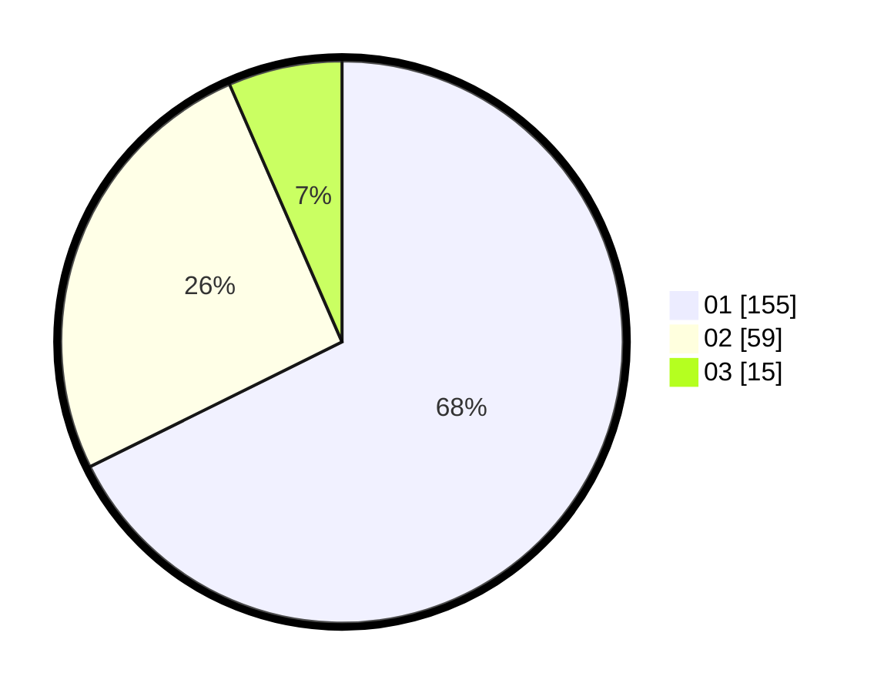

# Hasil

Hasil perolehan suara paslon dapat dilihat pada file paslon-01.txt, paslon-02.txt, dan paslon-03.txt.

Jika tidak ada, artinya data tersebut belum ada pada SIREKAP.

## Perolehan Suara

 * Paslon 01: **155**.
 * Paslon 02: **59**.
 * Paslon 03: **15**.

## Foto C Plano

https://sirekap-obj-formc.kpu.go.id/ade4/pemilu/ppwp/31/75/07/10/02/3175071002119-20240216-014006--8afaa562-a8a8-495e-9e36-4156f171b551.jpg

https://sirekap-obj-formc.kpu.go.id/ade4/pemilu/ppwp/31/75/07/10/02/3175071002119-20240216-014015--80a637bd-9b23-44b6-b708-af568ca14c19.jpg

https://sirekap-obj-formc.kpu.go.id/ade4/pemilu/ppwp/31/75/07/10/02/3175071002119-20240216-014012--0c56a701-4ae0-4deb-ac02-2eea2ee6d8d2.jpg

## DATA PEMILIH TETAP

Jumlah pemilih dalam DPT: **268**.
 * L: **134**.
 * P: **134**.

## DATA PENGGUNA HAK PILIH

Jumlah pengguna hak pilih dalam DPT: **226**.
 * L: **113**.
 * P: **113**.

Jumlah pengguna hak pilih dalam DPTb: **0**.
 * L: **0**.
 * P: **0**.

Jumlah pengguna hak pilih dalam DPK: **4**.
 * L: **2**.
 * P: **2**.

Jumlah pengguna hak pilih: **230**.
 * L: **115**.
 * P: **115**.

## JUMLAH SUARA SAH DAN TIDAK SAH

JUMLAH SELURUH SUARA SAH: **229**.

JUMLAH SUARA TIDAK SAH: **1**.

JUMLAH SELURUH SUARA SAH DAN SUARA TIDAK SAH: **230**.
