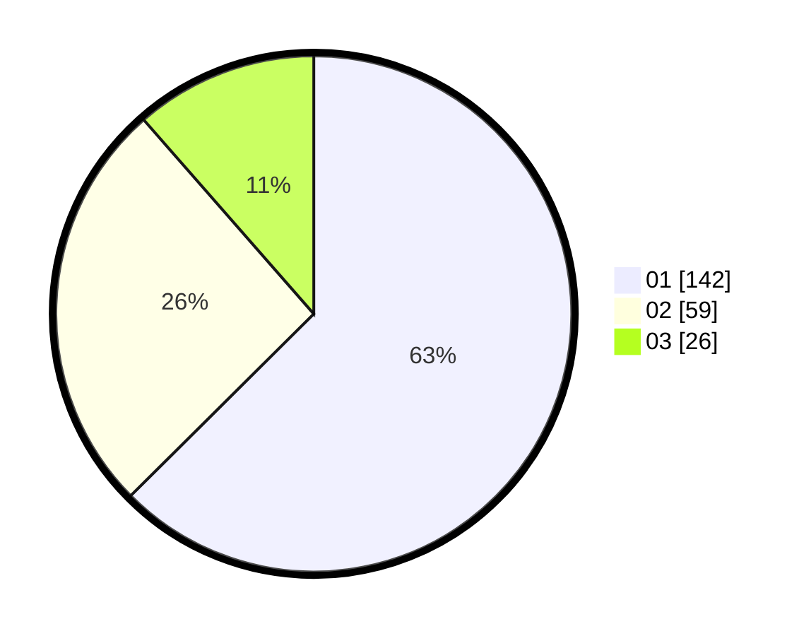

# Hasil

Hasil perolehan suara paslon dapat dilihat pada file paslon-01.txt, paslon-02.txt, dan paslon-03.txt.

Jika tidak ada, artinya data tersebut belum ada pada SIREKAP.

## Perolehan Suara

 * Paslon 01: **142**.
 * Paslon 02: **59**.
 * Paslon 03: **26**.

## Foto C Plano

https://sirekap-obj-formc.kpu.go.id/2184/pemilu/ppwp/31/75/07/10/02/3175071002122-20240217-090912--3f82175e-01c5-4cf9-beb1-bd85c4e7093f.jpg

https://sirekap-obj-formc.kpu.go.id/2184/pemilu/ppwp/31/75/07/10/02/3175071002122-20240215-183740--ef11c94c-a87a-4ae4-b7c8-f570cfac6a21.jpg

https://sirekap-obj-formc.kpu.go.id/2184/pemilu/ppwp/31/75/07/10/02/3175071002122-20240217-183906--a3469732-29a3-4b2e-a265-9410548e48e7.jpg

## DATA PEMILIH TETAP

Jumlah pemilih dalam DPT: **277**.
 * L: **131**.
 * P: **146**.

## DATA PENGGUNA HAK PILIH

Jumlah pengguna hak pilih dalam DPT: **228**.
 * L: **108**.
 * P: **120**.

Jumlah pengguna hak pilih dalam DPTb: **2**.
 * L: **1**.
 * P: **1**.

Jumlah pengguna hak pilih dalam DPK: **0**.
 * L: **0**.
 * P: **0**.

Jumlah pengguna hak pilih: **230**.
 * L: **109**.
 * P: **121**.

## JUMLAH SUARA SAH DAN TIDAK SAH

JUMLAH SELURUH SUARA SAH: **227**.

JUMLAH SUARA TIDAK SAH: **3**.

JUMLAH SELURUH SUARA SAH DAN SUARA TIDAK SAH: **230**.
