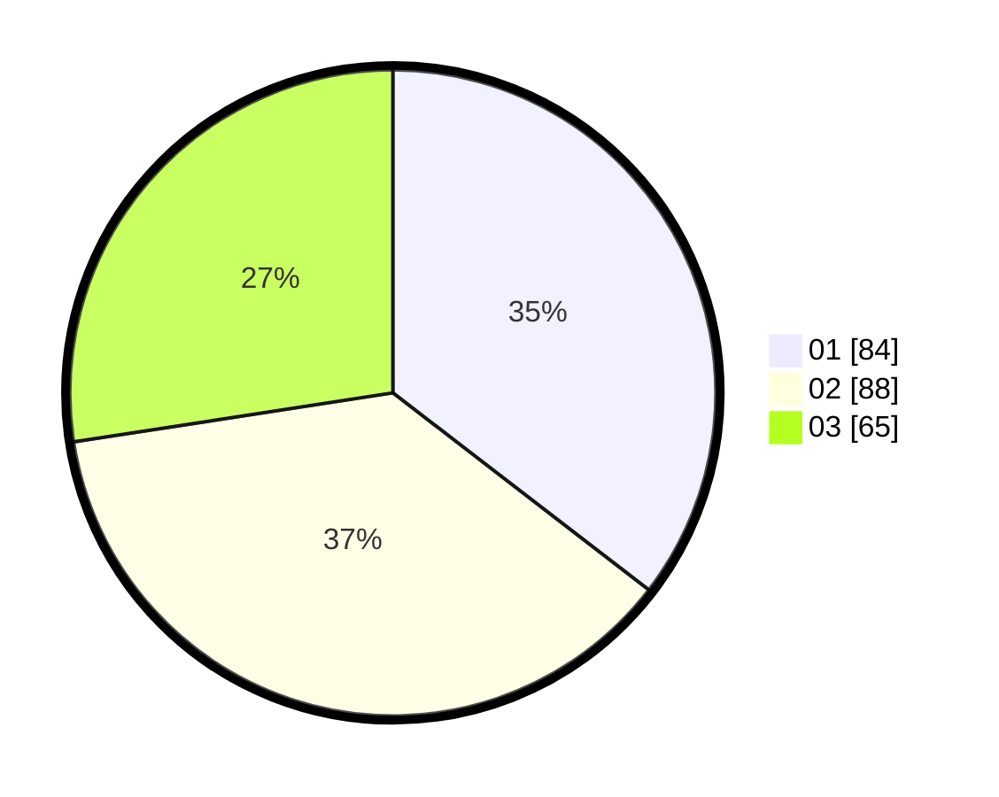

# Hasil

Hasil perolehan suara paslon dapat dilihat pada file paslon-01.txt, paslon-02.txt, dan paslon-03.txt.

Jika tidak ada, artinya data tersebut belum ada pada SIREKAP.

## Perolehan Suara

 * Paslon 01: **84**.
 * Paslon 02: **88**.
 * Paslon 03: **65**.

## Foto C Plano

https://sirekap-obj-formc.kpu.go.id/2265/pemilu/ppwp/31/75/07/10/02/3175071002123-20240214-185250--34357068-87c3-4647-af70-39ce6c825463.jpg

https://sirekap-obj-formc.kpu.go.id/2265/pemilu/ppwp/31/75/07/10/02/3175071002123-20240214-224020--9f18bd0e-07aa-4368-b5cd-b2a6a7c2d4e4.jpg

https://sirekap-obj-formc.kpu.go.id/2265/pemilu/ppwp/31/75/07/10/02/3175071002123-20240214-185317--629ab614-8d37-4134-b941-91df9e1f3529.jpg

## DATA PEMILIH TETAP

Jumlah pemilih dalam DPT: **267**.
 * L: **136**.
 * P: **131**.

## DATA PENGGUNA HAK PILIH

Jumlah pengguna hak pilih dalam DPT: **240**.
 * L: **119**.
 * P: **121**.

Jumlah pengguna hak pilih dalam DPTb: **2**.
 * L: **2**.
 * P: **0**.

Jumlah pengguna hak pilih dalam DPK: **0**.
 * L: **0**.
 * P: **0**.

Jumlah pengguna hak pilih: **242**.
 * L: **121**.
 * P: **121**.

## JUMLAH SUARA SAH DAN TIDAK SAH

JUMLAH SELURUH SUARA SAH: **237**.

JUMLAH SUARA TIDAK SAH: **5**.

JUMLAH SELURUH SUARA SAH DAN SUARA TIDAK SAH: **242**.
