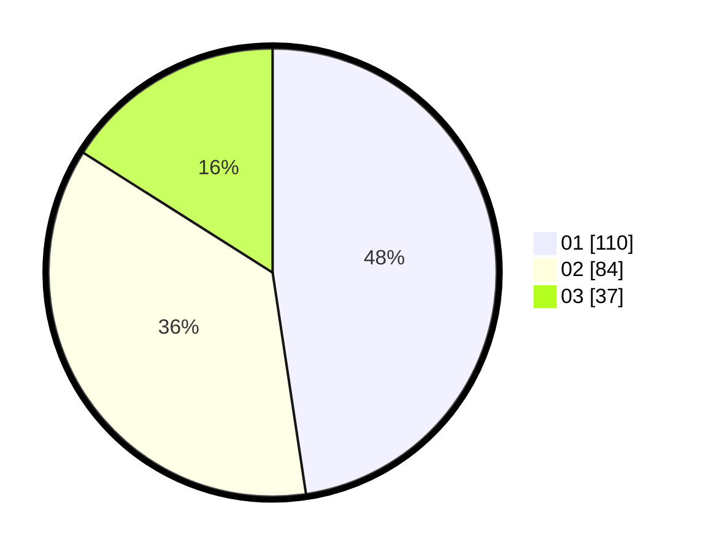

# Hasil

Hasil perolehan suara paslon dapat dilihat pada file paslon-01.txt, paslon-02.txt, dan paslon-03.txt.

Jika tidak ada, artinya data tersebut belum ada pada SIREKAP.

## Perolehan Suara

 * Paslon 01: **110**.
 * Paslon 02: **84**.
 * Paslon 03: **37**.

## Foto C Plano

https://sirekap-obj-formc.kpu.go.id/e259/pemilu/ppwp/31/75/07/10/02/3175071002125-20240214-234920--6d6abccc-5c0f-404a-a6e4-c7dec8a04166.jpg

https://sirekap-obj-formc.kpu.go.id/e259/pemilu/ppwp/31/75/07/10/02/3175071002125-20240214-235150--6f1d967d-63ce-471a-92cd-97645fbe0b2d.jpg

https://sirekap-obj-formc.kpu.go.id/e259/pemilu/ppwp/31/75/07/10/02/3175071002125-20240214-235358--7928f552-6b70-44ba-88e8-e25f5ede04f0.jpg
