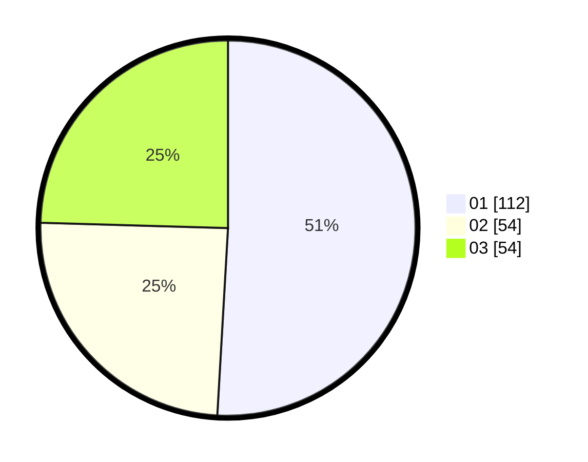

# Hasil

Hasil perolehan suara paslon dapat dilihat pada file paslon-01.txt, paslon-02.txt, dan paslon-03.txt.

Jika tidak ada, artinya data tersebut belum ada pada SIREKAP.

## Perolehan Suara

 * Paslon 01: **112**.
 * Paslon 02: **54**.
 * Paslon 03: **54**.

## Foto C Plano

https://sirekap-obj-formc.kpu.go.id/1290/pemilu/ppwp/31/75/07/10/02/3175071002128-20240216-132801--b89977b8-9ebc-4392-93de-fd48e73bdf85.jpg

https://sirekap-obj-formc.kpu.go.id/1290/pemilu/ppwp/31/75/07/10/02/3175071002128-20240216-133508--9e8acb86-f534-474e-aebf-753c8da4dbf2.jpg

https://sirekap-obj-formc.kpu.go.id/1290/pemilu/ppwp/31/75/07/10/02/3175071002128-20240216-133719--2709c9f2-a9af-480a-a8a1-0489c80aa399.jpg

## DATA PEMILIH TETAP

Jumlah pemilih dalam DPT: **259**.
 * L: **123**.
 * P: **136**.

## DATA PENGGUNA HAK PILIH

Jumlah pengguna hak pilih dalam DPT: **221**.
 * L: **102**.
 * P: **119**.

Jumlah pengguna hak pilih dalam DPTb: **0**.
 * L: **0**.
 * P: **0**.

Jumlah pengguna hak pilih dalam DPK: **2**.
 * L: **0**.
 * P: **2**.

Jumlah pengguna hak pilih: **223**.
 * L: **102**.
 * P: **121**.

## JUMLAH SUARA SAH DAN TIDAK SAH

JUMLAH SELURUH SUARA SAH: **220**.

JUMLAH SUARA TIDAK SAH: **3**.

JUMLAH SELURUH SUARA SAH DAN SUARA TIDAK SAH: **223**.
