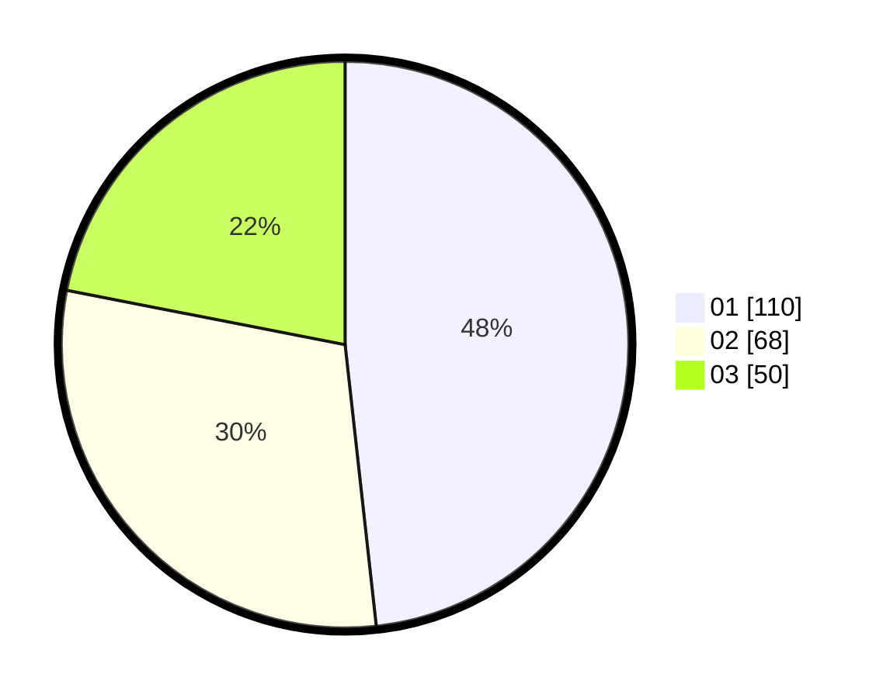

# Hasil

Hasil perolehan suara paslon dapat dilihat pada file paslon-01.txt, paslon-02.txt, dan paslon-03.txt.

Jika tidak ada, artinya data tersebut belum ada pada SIREKAP.

## Perolehan Suara

 * Paslon 01: **110**.
 * Paslon 02: **68**.
 * Paslon 03: **50**.

## Foto C Plano

https://sirekap-obj-formc.kpu.go.id/95d5/pemilu/ppwp/31/75/07/10/02/3175071002129-20240218-213859--ca369161-0c52-40ea-858f-6bdb54f0796a.jpg

https://sirekap-obj-formc.kpu.go.id/95d5/pemilu/ppwp/31/75/07/10/02/3175071002129-20240218-214021--d3a319ff-bdff-4375-a8da-1a1579e39a6b.jpg

https://sirekap-obj-formc.kpu.go.id/95d5/pemilu/ppwp/31/75/07/10/02/3175071002129-20240218-214128--357d8fe4-5bd7-45fe-858c-62a7dd9983ae.jpg

## DATA PEMILIH TETAP

Jumlah pemilih dalam DPT: **256**.
 * L: **115**.
 * P: **141**.

## DATA PENGGUNA HAK PILIH

Jumlah pengguna hak pilih dalam DPT: **224**.
 * L: **98**.
 * P: **126**.

Jumlah pengguna hak pilih dalam DPTb: **2**.
 * L: **1**.
 * P: **1**.

Jumlah pengguna hak pilih dalam DPK: **6**.
 * L: **3**.
 * P: **3**.

Jumlah pengguna hak pilih: **232**.
 * L: **102**.
 * P: **130**.

## JUMLAH SUARA SAH DAN TIDAK SAH

JUMLAH SELURUH SUARA SAH: **228**.

JUMLAH SUARA TIDAK SAH: **4**.

JUMLAH SELURUH SUARA SAH DAN SUARA TIDAK SAH: **232**.
