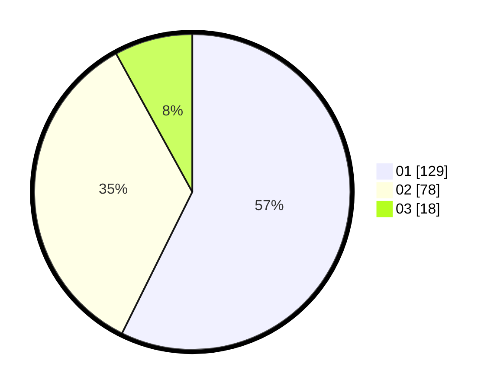

# Hasil

Hasil perolehan suara paslon dapat dilihat pada file paslon-01.txt, paslon-02.txt, dan paslon-03.txt.

Jika tidak ada, artinya data tersebut belum ada pada SIREKAP.

## Perolehan Suara

 * Paslon 01: **129**.
 * Paslon 02: **78**.
 * Paslon 03: **18**.

## Foto C Plano

https://sirekap-obj-formc.kpu.go.id/eaf8/pemilu/ppwp/31/75/07/10/02/3175071002131-20240215-024333--f791b3f3-b83b-45f8-acb3-ad93f84ac8e2.jpg

https://sirekap-obj-formc.kpu.go.id/eaf8/pemilu/ppwp/31/75/07/10/02/3175071002131-20240215-024435--bccd1ce4-7b9a-4111-9ff7-f89299d4f108.jpg

https://sirekap-obj-formc.kpu.go.id/eaf8/pemilu/ppwp/31/75/07/10/02/3175071002131-20240215-024649--66ad054b-f855-470e-b9b7-dc5a8c2720f7.jpg

## DATA PEMILIH TETAP

Jumlah pemilih dalam DPT: **264**.
 * L: **123**.
 * P: **141**.

## DATA PENGGUNA HAK PILIH

Jumlah pengguna hak pilih dalam DPT: **223**.
 * L: **102**.
 * P: **121**.

Jumlah pengguna hak pilih dalam DPTb: **1**.
 * L: **0**.
 * P: **1**.

Jumlah pengguna hak pilih dalam DPK: **2**.
 * L: **1**.
 * P: **1**.

Jumlah pengguna hak pilih: **226**.
 * L: **103**.
 * P: **123**.

## JUMLAH SUARA SAH DAN TIDAK SAH

JUMLAH SELURUH SUARA SAH: **225**.

JUMLAH SUARA TIDAK SAH: **1**.

JUMLAH SELURUH SUARA SAH DAN SUARA TIDAK SAH: **226**.
