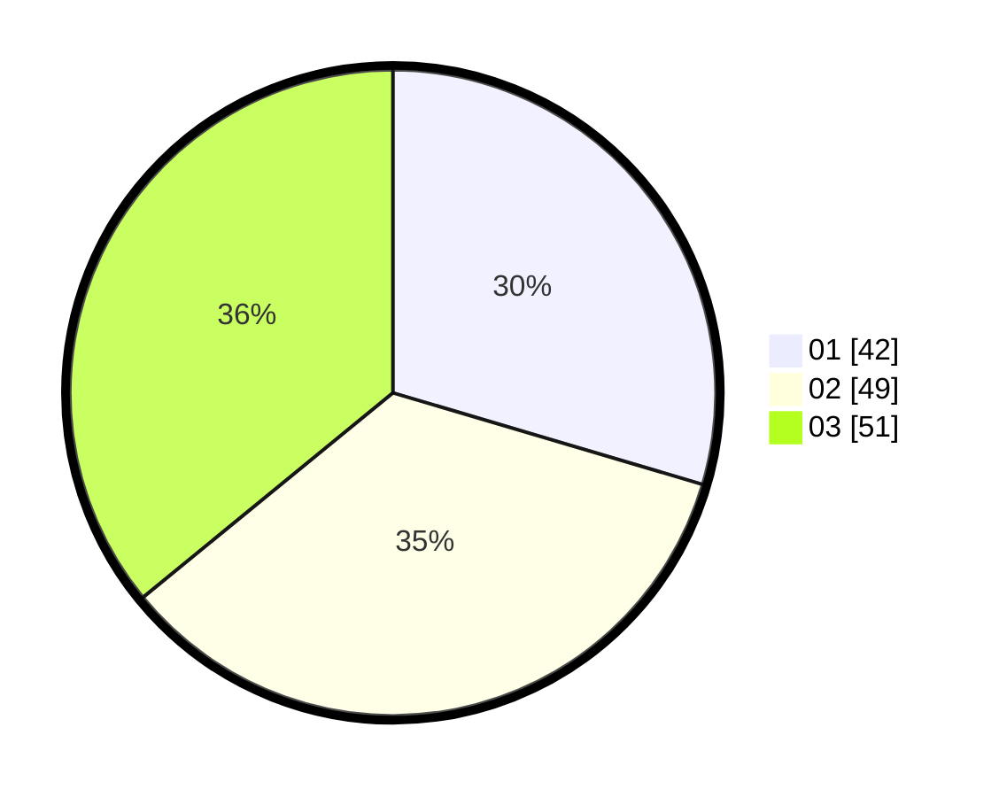

# Hasil

Hasil perolehan suara paslon dapat dilihat pada file paslon-01.txt, paslon-02.txt, dan paslon-03.txt.

Jika tidak ada, artinya data tersebut belum ada pada SIREKAP.

## Perolehan Suara

 * Paslon 01: **42**.
 * Paslon 02: **49**.
 * Paslon 03: **51**.

## Foto C Plano

https://sirekap-obj-formc.kpu.go.id/37fd/pemilu/ppwp/31/75/07/10/02/3175071002133-20240214-212906--7c74a721-7355-4b1f-bf6f-0f08eddca953.jpg

https://sirekap-obj-formc.kpu.go.id/37fd/pemilu/ppwp/31/75/07/10/02/3175071002133-20240214-213245--723730ce-7fb8-4176-adb2-d122182f4cf8.jpg

https://sirekap-obj-formc.kpu.go.id/37fd/pemilu/ppwp/31/75/07/10/02/3175071002133-20240214-213420--806f222b-3c0e-47e7-a1ab-ac911fff3b28.jpg
