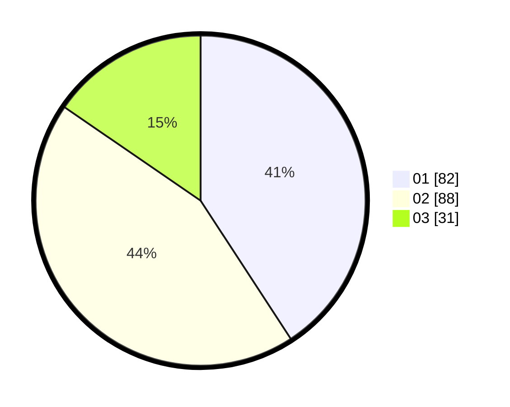

# Hasil

Hasil perolehan suara paslon dapat dilihat pada file paslon-01.txt, paslon-02.txt, dan paslon-03.txt.

Jika tidak ada, artinya data tersebut belum ada pada SIREKAP.

## Perolehan Suara

 * Paslon 01: **82**.
 * Paslon 02: **88**.
 * Paslon 03: **31**.

## Foto C Plano

https://sirekap-obj-formc.kpu.go.id/ef7e/pemilu/ppwp/31/75/07/10/02/3175071002135-20240216-092118--3c43a57b-22ef-44de-8d37-9b104da3bbf4.jpg

https://sirekap-obj-formc.kpu.go.id/ef7e/pemilu/ppwp/31/75/07/10/02/3175071002135-20240216-092120--45710fc6-15c3-4d84-95b6-49dc6c2180da.jpg

https://sirekap-obj-formc.kpu.go.id/ef7e/pemilu/ppwp/31/75/07/10/02/3175071002135-20240216-092119--78c22619-095d-4849-950c-8910ab8fff11.jpg

## DATA PEMILIH TETAP

Jumlah pemilih dalam DPT: **276**.
 * L: **139**.
 * P: **137**.

## DATA PENGGUNA HAK PILIH

Jumlah pengguna hak pilih dalam DPT: **197**.
 * L: **93**.
 * P: **104**.

Jumlah pengguna hak pilih dalam DPTb: **5**.
 * L: **2**.
 * P: **3**.

Jumlah pengguna hak pilih dalam DPK: **1**.
 * L: **0**.
 * P: **1**.

Jumlah pengguna hak pilih: **203**.
 * L: **95**.
 * P: **108**.

## JUMLAH SUARA SAH DAN TIDAK SAH

JUMLAH SELURUH SUARA SAH: **201**.

JUMLAH SUARA TIDAK SAH: **2**.

JUMLAH SELURUH SUARA SAH DAN SUARA TIDAK SAH: **203**.
