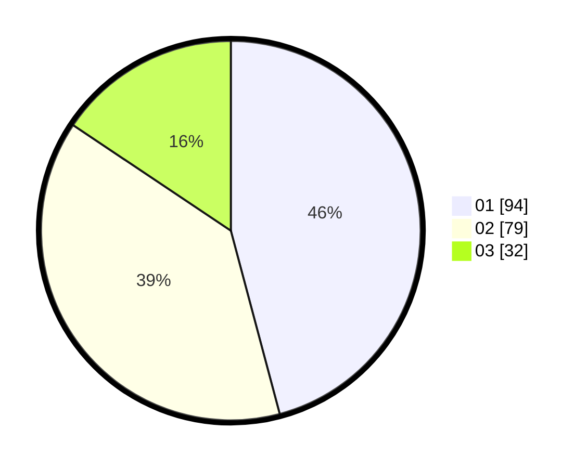

# Hasil

Hasil perolehan suara paslon dapat dilihat pada file paslon-01.txt, paslon-02.txt, dan paslon-03.txt.

Jika tidak ada, artinya data tersebut belum ada pada SIREKAP.

## Perolehan Suara

 * Paslon 01: **94**.
 * Paslon 02: **79**.
 * Paslon 03: **32**.

## Foto C Plano

https://sirekap-obj-formc.kpu.go.id/8ae1/pemilu/ppwp/31/75/07/10/02/3175071002136-20240217-231634--0088b136-7fe2-4a3a-b02d-863ce05e9159.jpg

https://sirekap-obj-formc.kpu.go.id/8ae1/pemilu/ppwp/31/75/07/10/02/3175071002136-20240214-200339--d13ef9cc-3b5c-453c-ad00-b85c2ab7c56f.jpg

https://sirekap-obj-formc.kpu.go.id/8ae1/pemilu/ppwp/31/75/07/10/02/3175071002136-20240217-231634--c275c79d-0f3a-4b40-907f-214a2f2241c7.jpg

## DATA PEMILIH TETAP

Jumlah pemilih dalam DPT: **274**.
 * L: **130**.
 * P: **144**.

## DATA PENGGUNA HAK PILIH

Jumlah pengguna hak pilih dalam DPT: **207**.
 * L: **96**.
 * P: **111**.

Jumlah pengguna hak pilih dalam DPTb: **0**.
 * L: **0**.
 * P: **0**.

Jumlah pengguna hak pilih dalam DPK: **0**.
 * L: **0**.
 * P: **0**.

Jumlah pengguna hak pilih: **207**.
 * L: **96**.
 * P: **111**.

## JUMLAH SUARA SAH DAN TIDAK SAH

JUMLAH SELURUH SUARA SAH: **205**.

JUMLAH SUARA TIDAK SAH: **2**.

JUMLAH SELURUH SUARA SAH DAN SUARA TIDAK SAH: **207**.
