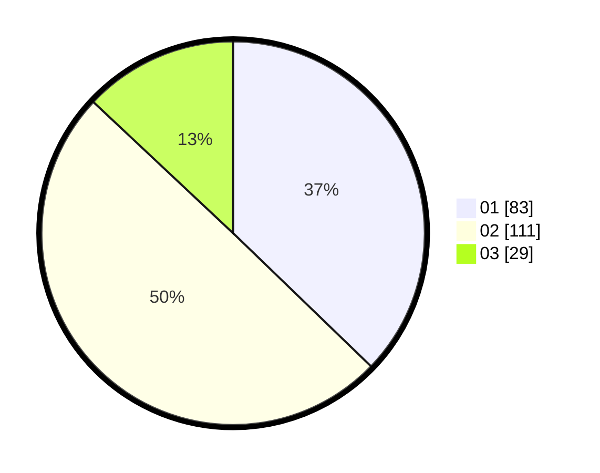

# Hasil

Hasil perolehan suara paslon dapat dilihat pada file paslon-01.txt, paslon-02.txt, dan paslon-03.txt.

Jika tidak ada, artinya data tersebut belum ada pada SIREKAP.

## Perolehan Suara

 * Paslon 01: **83**.
 * Paslon 02: **111**.
 * Paslon 03: **29**.

## Foto C Plano

https://sirekap-obj-formc.kpu.go.id/83e1/pemilu/ppwp/31/75/07/10/02/3175071002137-20240216-125824--e0932222-d29c-4f5d-98dc-9a19368e76c4.jpg

https://sirekap-obj-formc.kpu.go.id/83e1/pemilu/ppwp/31/75/07/10/02/3175071002137-20240216-125915--ef069bb6-3388-416d-a053-dae6dcb09f45.jpg

https://sirekap-obj-formc.kpu.go.id/83e1/pemilu/ppwp/31/75/07/10/02/3175071002137-20240216-135603--3d60a5eb-4a0b-49f0-8985-5ca4a72a7854.jpg

## DATA PEMILIH TETAP

Jumlah pemilih dalam DPT: **263**.
 * L: **136**.
 * P: **127**.

## DATA PENGGUNA HAK PILIH

Jumlah pengguna hak pilih dalam DPT: **226**.
 * L: **117**.
 * P: **109**.

Jumlah pengguna hak pilih dalam DPTb: **2**.
 * L: **0**.
 * P: **2**.

Jumlah pengguna hak pilih dalam DPK: **3**.
 * L: **1**.
 * P: **2**.

Jumlah pengguna hak pilih: **231**.
 * L: **118**.
 * P: **113**.

## JUMLAH SUARA SAH DAN TIDAK SAH

JUMLAH SELURUH SUARA SAH: **227**.

JUMLAH SUARA TIDAK SAH: **4**.

JUMLAH SELURUH SUARA SAH DAN SUARA TIDAK SAH: **231**.
