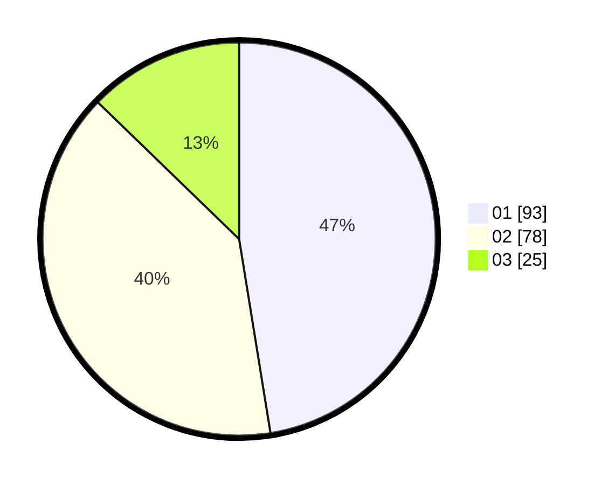

# Hasil

Hasil perolehan suara paslon dapat dilihat pada file paslon-01.txt, paslon-02.txt, dan paslon-03.txt.

Jika tidak ada, artinya data tersebut belum ada pada SIREKAP.

## Perolehan Suara

 * Paslon 01: **93**.
 * Paslon 02: **78**.
 * Paslon 03: **25**.

## Foto C Plano

https://sirekap-obj-formc.kpu.go.id/5d8c/pemilu/ppwp/31/75/07/10/02/3175071002144-20240216-152221--8ca54ac0-ad45-4fca-bfb7-93344197b865.jpg

https://sirekap-obj-formc.kpu.go.id/5d8c/pemilu/ppwp/31/75/07/10/02/3175071002144-20240216-152222--d83e9b1f-386e-4c3b-97b2-4feb7b3f5a48.jpg

https://sirekap-obj-formc.kpu.go.id/5d8c/pemilu/ppwp/31/75/07/10/02/3175071002144-20240216-152222--18c7cc4c-41b3-467a-877a-f707e161d42e.jpg

## DATA PEMILIH TETAP

Jumlah pemilih dalam DPT: **269**.
 * L: **140**.
 * P: **129**.

## DATA PENGGUNA HAK PILIH

Jumlah pengguna hak pilih dalam DPT: **196**.
 * L: **91**.
 * P: **105**.

Jumlah pengguna hak pilih dalam DPTb: **4**.
 * L: **2**.
 * P: **2**.

Jumlah pengguna hak pilih dalam DPK: **1**.
 * L: **1**.
 * P: **0**.

Jumlah pengguna hak pilih: **201**.
 * L: **94**.
 * P: **107**.

## JUMLAH SUARA SAH DAN TIDAK SAH

JUMLAH SELURUH SUARA SAH: **196**.

JUMLAH SUARA TIDAK SAH: **5**.

JUMLAH SELURUH SUARA SAH DAN SUARA TIDAK SAH: **201**.
