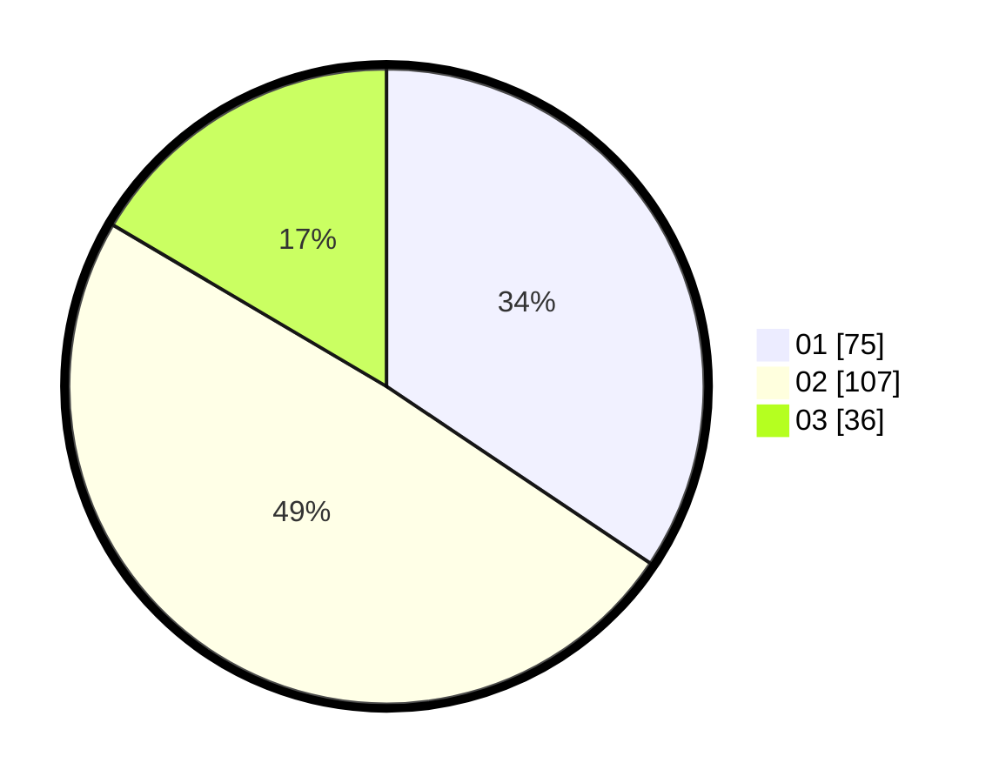

# Hasil

Hasil perolehan suara paslon dapat dilihat pada file paslon-01.txt, paslon-02.txt, dan paslon-03.txt.

Jika tidak ada, artinya data tersebut belum ada pada SIREKAP.

## Perolehan Suara

 * Paslon 01: **75**.
 * Paslon 02: **107**.
 * Paslon 03: **36**.

## Foto C Plano

https://sirekap-obj-formc.kpu.go.id/159a/pemilu/ppwp/31/75/07/10/02/3175071002147-20240215-043514--2c5aa5a3-2bb0-47ea-90a7-81e450ce3714.jpg

https://sirekap-obj-formc.kpu.go.id/159a/pemilu/ppwp/31/75/07/10/02/3175071002147-20240215-043518--e05e8aee-8a9b-40fe-bf4c-32d827b6bc71.jpg

https://sirekap-obj-formc.kpu.go.id/159a/pemilu/ppwp/31/75/07/10/02/3175071002147-20240215-043522--63100238-dbe9-4ccc-bf10-095f05c23ebf.jpg

## DATA PEMILIH TETAP

Jumlah pemilih dalam DPT: **216**.
 * L: **98**.
 * P: **118**.

## DATA PENGGUNA HAK PILIH

Jumlah pengguna hak pilih dalam DPT: **216**.
 * L: **98**.
 * P: **118**.

Jumlah pengguna hak pilih dalam DPTb: **1**.
 * L: **0**.
 * P: **1**.

Jumlah pengguna hak pilih dalam DPK: **2**.
 * L: **2**.
 * P: **0**.

Jumlah pengguna hak pilih: **219**.
 * L: **100**.
 * P: **119**.

## JUMLAH SUARA SAH DAN TIDAK SAH

JUMLAH SELURUH SUARA SAH: **218**.

JUMLAH SUARA TIDAK SAH: **1**.

JUMLAH SELURUH SUARA SAH DAN SUARA TIDAK SAH: **219**.
