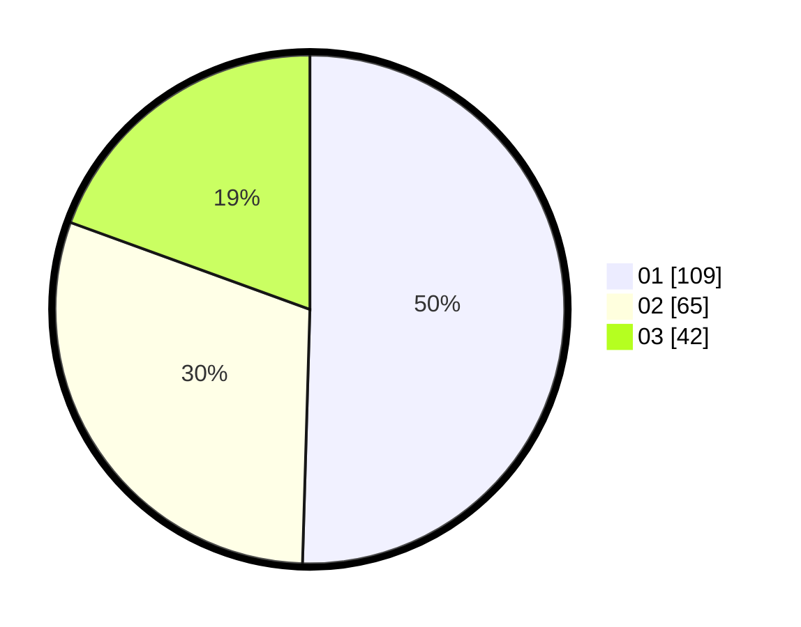

# Hasil

Hasil perolehan suara paslon dapat dilihat pada file paslon-01.txt, paslon-02.txt, dan paslon-03.txt.

Jika tidak ada, artinya data tersebut belum ada pada SIREKAP.

## Perolehan Suara

 * Paslon 01: **109**.
 * Paslon 02: **65**.
 * Paslon 03: **42**.

## Foto C Plano

https://sirekap-obj-formc.kpu.go.id/811d/pemilu/ppwp/31/75/07/10/02/3175071002149-20240214-155048--daee1a46-ba18-459c-b2db-c4f94b81c8af.jpg

https://sirekap-obj-formc.kpu.go.id/811d/pemilu/ppwp/31/75/07/10/02/3175071002149-20240214-155107--3f59423b-d623-4b22-906d-286ecd025994.jpg

https://sirekap-obj-formc.kpu.go.id/811d/pemilu/ppwp/31/75/07/10/02/3175071002149-20240214-155122--62c8c2b0-ac1d-437d-90d5-a3274aa7e3a7.jpg

## DATA PEMILIH TETAP

Jumlah pemilih dalam DPT: **266**.
 * L: **125**.
 * P: **141**.

## DATA PENGGUNA HAK PILIH

Jumlah pengguna hak pilih dalam DPT: **215**.
 * L: **96**.
 * P: **119**.

Jumlah pengguna hak pilih dalam DPTb: **0**.
 * L: **0**.
 * P: **0**.

Jumlah pengguna hak pilih dalam DPK: **5**.
 * L: **1**.
 * P: **4**.

Jumlah pengguna hak pilih: **220**.
 * L: **97**.
 * P: **123**.

## JUMLAH SUARA SAH DAN TIDAK SAH

JUMLAH SELURUH SUARA SAH: **216**.

JUMLAH SUARA TIDAK SAH: **4**.

JUMLAH SELURUH SUARA SAH DAN SUARA TIDAK SAH: **220**.
