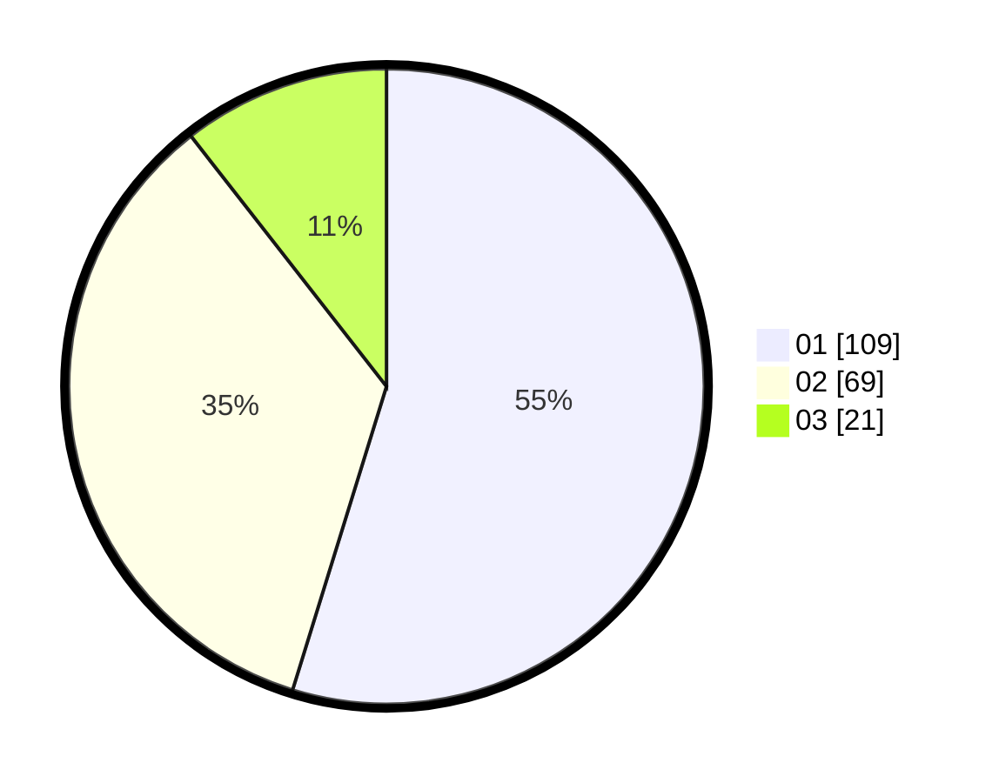

# Hasil

Hasil perolehan suara paslon dapat dilihat pada file paslon-01.txt, paslon-02.txt, dan paslon-03.txt.

Jika tidak ada, artinya data tersebut belum ada pada SIREKAP.

## Perolehan Suara

 * Paslon 01: **109**.
 * Paslon 02: **69**.
 * Paslon 03: **21**.

## Foto C Plano

https://sirekap-obj-formc.kpu.go.id/3d35/pemilu/ppwp/31/75/07/10/02/3175071002150-20240216-115619--cb131e75-d031-4d21-8d73-157ff8fcb65c.jpg

https://sirekap-obj-formc.kpu.go.id/3d35/pemilu/ppwp/31/75/07/10/02/3175071002150-20240216-115624--865bcc2e-ba6e-4661-814e-23a0455d1122.jpg

https://sirekap-obj-formc.kpu.go.id/3d35/pemilu/ppwp/31/75/07/10/02/3175071002150-20240216-115621--96b3d789-b0db-44a5-9a9c-03977589d079.jpg

## DATA PEMILIH TETAP

Jumlah pemilih dalam DPT: **258**.
 * L: **112**.
 * P: **146**.

## DATA PENGGUNA HAK PILIH

Jumlah pengguna hak pilih dalam DPT: **196**.
 * L: **82**.
 * P: **114**.

Jumlah pengguna hak pilih dalam DPTb: **0**.
 * L: **0**.
 * P: **0**.

Jumlah pengguna hak pilih dalam DPK: **3**.
 * L: **2**.
 * P: **1**.

Jumlah pengguna hak pilih: **199**.
 * L: **84**.
 * P: **115**.

## JUMLAH SUARA SAH DAN TIDAK SAH

JUMLAH SELURUH SUARA SAH: **199**.

JUMLAH SUARA TIDAK SAH: **0**.

JUMLAH SELURUH SUARA SAH DAN SUARA TIDAK SAH: **199**.
