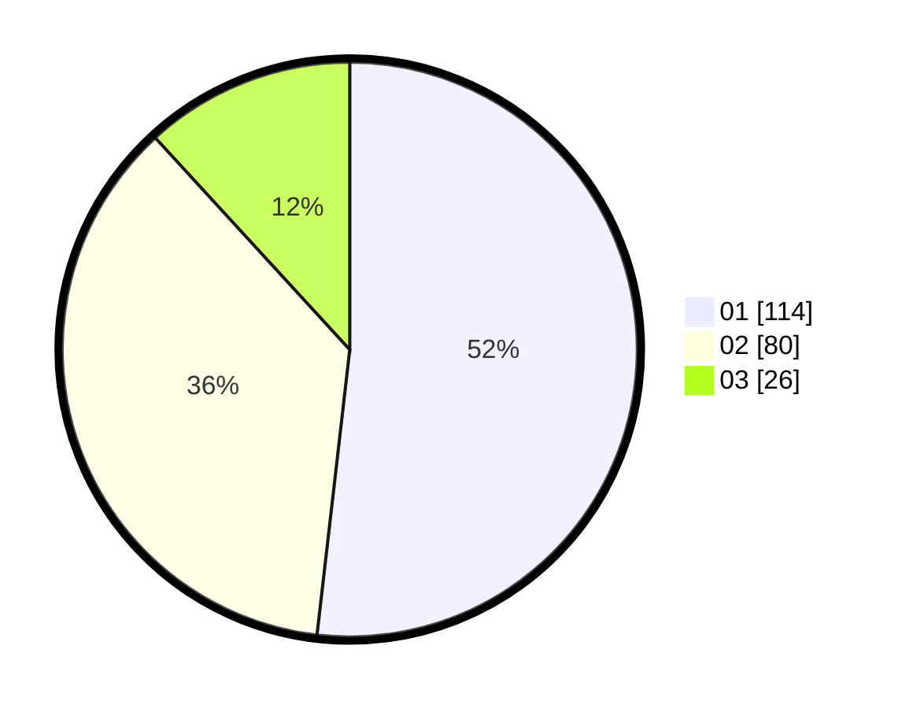

# Hasil

Hasil perolehan suara paslon dapat dilihat pada file paslon-01.txt, paslon-02.txt, dan paslon-03.txt.

Jika tidak ada, artinya data tersebut belum ada pada SIREKAP.

## Perolehan Suara

 * Paslon 01: **114**.
 * Paslon 02: **80**.
 * Paslon 03: **26**.

## Foto C Plano

https://sirekap-obj-formc.kpu.go.id/3b9e/pemilu/ppwp/31/75/07/10/02/3175071002151-20240216-131007--9401cfa0-3c0b-4342-a188-74dae643235a.jpg

https://sirekap-obj-formc.kpu.go.id/3b9e/pemilu/ppwp/31/75/07/10/02/3175071002151-20240216-131008--e92a2983-416e-4fe1-bfae-46d1d7b8f632.jpg

https://sirekap-obj-formc.kpu.go.id/3b9e/pemilu/ppwp/31/75/07/10/02/3175071002151-20240216-131007--01437532-1fe8-460a-bc9d-038102835822.jpg

## DATA PEMILIH TETAP

Jumlah pemilih dalam DPT: **265**.
 * L: **126**.
 * P: **139**.

## DATA PENGGUNA HAK PILIH

Jumlah pengguna hak pilih dalam DPT: **221**.
 * L: **104**.
 * P: **117**.

Jumlah pengguna hak pilih dalam DPTb: **2**.
 * L: **1**.
 * P: **1**.

Jumlah pengguna hak pilih dalam DPK: **0**.
 * L: **0**.
 * P: **0**.

Jumlah pengguna hak pilih: **223**.
 * L: **105**.
 * P: **118**.

## JUMLAH SUARA SAH DAN TIDAK SAH

JUMLAH SELURUH SUARA SAH: **220**.

JUMLAH SUARA TIDAK SAH: **3**.

JUMLAH SELURUH SUARA SAH DAN SUARA TIDAK SAH: **223**.
