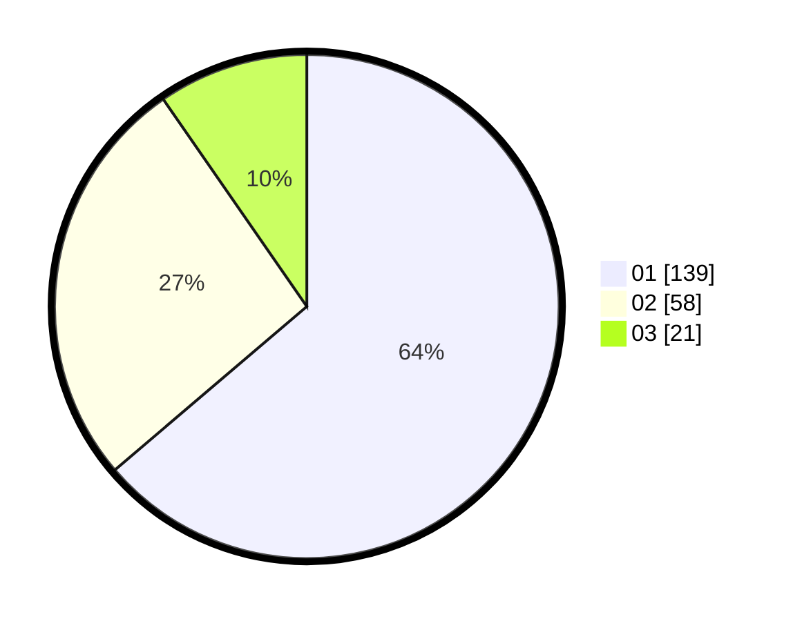

# Hasil

Hasil perolehan suara paslon dapat dilihat pada file paslon-01.txt, paslon-02.txt, dan paslon-03.txt.

Jika tidak ada, artinya data tersebut belum ada pada SIREKAP.

## Perolehan Suara

 * Paslon 01: **139**.
 * Paslon 02: **58**.
 * Paslon 03: **21**.

## Foto C Plano

https://sirekap-obj-formc.kpu.go.id/5ae4/pemilu/ppwp/31/75/07/10/02/3175071002153-20240216-001829--09525655-6174-4860-a295-5d4eeafc2395.jpg

https://sirekap-obj-formc.kpu.go.id/5ae4/pemilu/ppwp/31/75/07/10/02/3175071002153-20240216-001833--44af1c8e-ef71-491d-8af3-ef52c8760dad.jpg

https://sirekap-obj-formc.kpu.go.id/5ae4/pemilu/ppwp/31/75/07/10/02/3175071002153-20240216-001830--7262d21c-f965-46cf-91a7-7cf61a04e80d.jpg

## DATA PEMILIH TETAP

Jumlah pemilih dalam DPT: **269**.
 * L: **134**.
 * P: **135**.

## DATA PENGGUNA HAK PILIH

Jumlah pengguna hak pilih dalam DPT: **215**.
 * L: **103**.
 * P: **112**.

Jumlah pengguna hak pilih dalam DPTb: **0**.
 * L: **0**.
 * P: **0**.

Jumlah pengguna hak pilih dalam DPK: **5**.
 * L: **1**.
 * P: **4**.

Jumlah pengguna hak pilih: **220**.
 * L: **104**.
 * P: **116**.

## JUMLAH SUARA SAH DAN TIDAK SAH

JUMLAH SELURUH SUARA SAH: **218**.

JUMLAH SUARA TIDAK SAH: **2**.

JUMLAH SELURUH SUARA SAH DAN SUARA TIDAK SAH: **220**.
