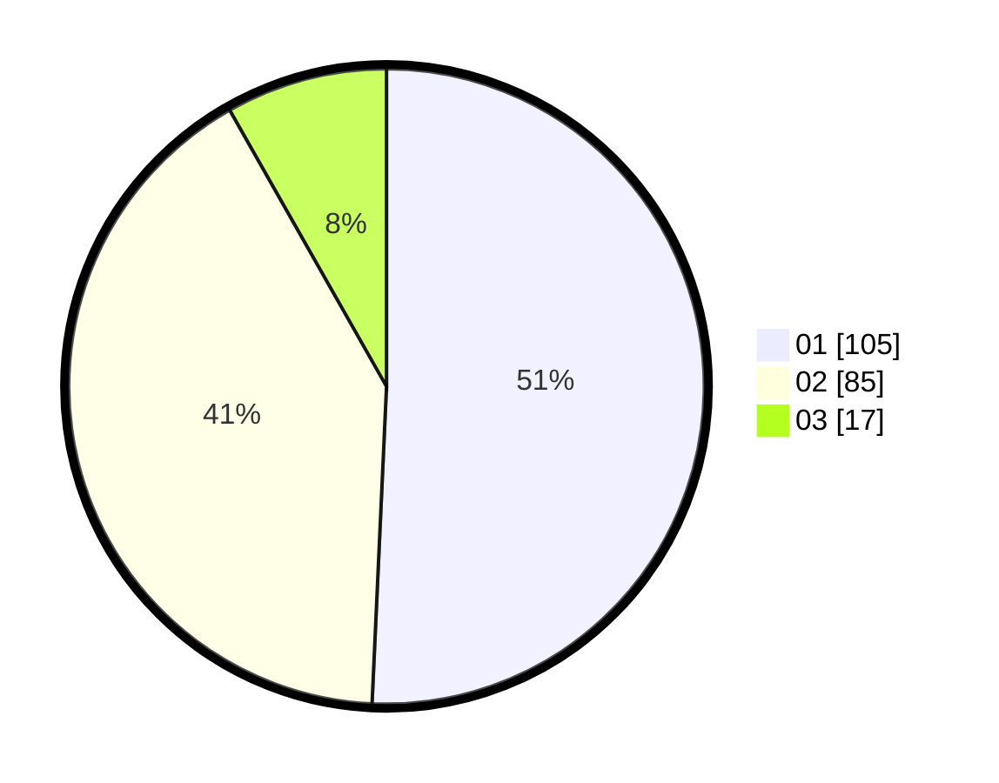

# Hasil

Hasil perolehan suara paslon dapat dilihat pada file paslon-01.txt, paslon-02.txt, dan paslon-03.txt.

Jika tidak ada, artinya data tersebut belum ada pada SIREKAP.

## Perolehan Suara

 * Paslon 01: **105**.
 * Paslon 02: **85**.
 * Paslon 03: **17**.

## Foto C Plano

https://sirekap-obj-formc.kpu.go.id/dd08/pemilu/ppwp/31/75/07/10/02/3175071002157-20240214-230808--6dea27fb-ed57-4815-bab7-548914b3ea5f.jpg

https://sirekap-obj-formc.kpu.go.id/dd08/pemilu/ppwp/31/75/07/10/02/3175071002157-20240215-223002--fd91a6fb-ec9e-425e-b28d-c76e8a89598b.jpg

https://sirekap-obj-formc.kpu.go.id/dd08/pemilu/ppwp/31/75/07/10/02/3175071002157-20240214-231229--ed29815b-31a0-415a-b203-6352955bf638.jpg

## DATA PEMILIH TETAP

Jumlah pemilih dalam DPT: **205**.
 * L: **95**.
 * P: **110**.

## DATA PENGGUNA HAK PILIH

Jumlah pengguna hak pilih dalam DPT: **205**.
 * L: **95**.
 * P: **110**.

Jumlah pengguna hak pilih dalam DPTb: **2**.
 * L: **1**.
 * P: **1**.

Jumlah pengguna hak pilih dalam DPK: **3**.
 * L: **1**.
 * P: **2**.

Jumlah pengguna hak pilih: **210**.
 * L: **97**.
 * P: **113**.

## JUMLAH SUARA SAH DAN TIDAK SAH

JUMLAH SELURUH SUARA SAH: **207**.

JUMLAH SUARA TIDAK SAH: **3**.

JUMLAH SELURUH SUARA SAH DAN SUARA TIDAK SAH: **210**.
