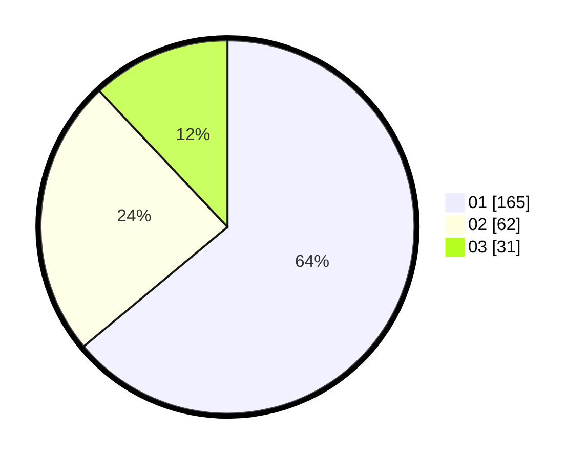

# Hasil

Hasil perolehan suara paslon dapat dilihat pada file paslon-01.txt, paslon-02.txt, dan paslon-03.txt.

Jika tidak ada, artinya data tersebut belum ada pada SIREKAP.

## Perolehan Suara

 * Paslon 01: **165**.
 * Paslon 02: **62**.
 * Paslon 03: **31**.

## Foto C Plano

https://sirekap-obj-formc.kpu.go.id/c700/pemilu/ppwp/31/75/07/10/02/3175071002160-20240214-200038--c6ff2b7e-f915-492f-926f-c2fba6fc9b53.jpg

https://sirekap-obj-formc.kpu.go.id/c700/pemilu/ppwp/31/75/07/10/02/3175071002160-20240214-200220--443a991a-1c2c-4364-81cd-6a26c7de2b94.jpg

https://sirekap-obj-formc.kpu.go.id/c700/pemilu/ppwp/31/75/07/10/02/3175071002160-20240214-200347--ed74010f-5401-4d0a-b94a-e811fa4a6e77.jpg

## DATA PEMILIH TETAP

Jumlah pemilih dalam DPT: **273**.
 * L: **131**.
 * P: **142**.

## DATA PENGGUNA HAK PILIH

Jumlah pengguna hak pilih dalam DPT: **222**.
 * L: **109**.
 * P: **113**.

Jumlah pengguna hak pilih dalam DPTb: **32**.
 * L: **19**.
 * P: **13**.

Jumlah pengguna hak pilih dalam DPK: **6**.
 * L: **2**.
 * P: **4**.

Jumlah pengguna hak pilih: **260**.
 * L: **130**.
 * P: **130**.

## JUMLAH SUARA SAH DAN TIDAK SAH

JUMLAH SELURUH SUARA SAH: **258**.

JUMLAH SUARA TIDAK SAH: **2**.

JUMLAH SELURUH SUARA SAH DAN SUARA TIDAK SAH: **260**.
