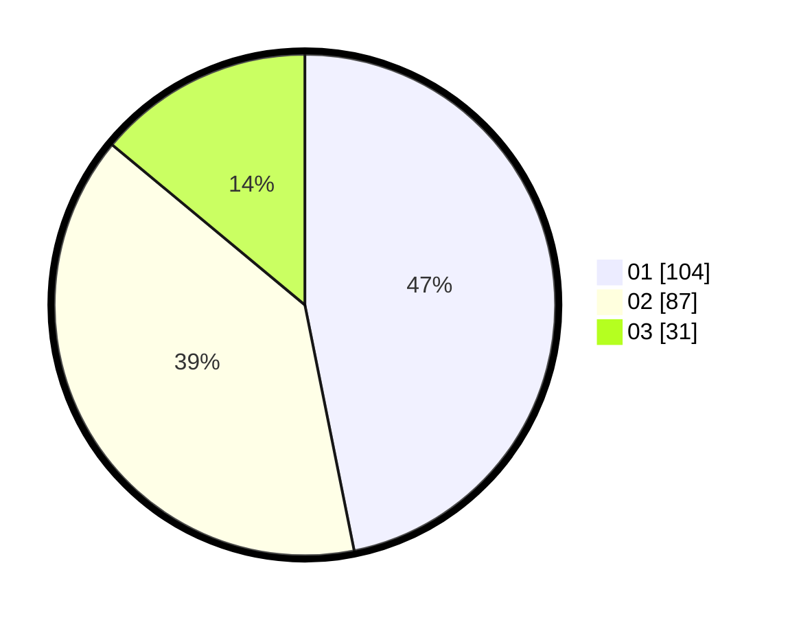

# Hasil

Hasil perolehan suara paslon dapat dilihat pada file paslon-01.txt, paslon-02.txt, dan paslon-03.txt.

Jika tidak ada, artinya data tersebut belum ada pada SIREKAP.

## Perolehan Suara

 * Paslon 01: **104**.
 * Paslon 02: **87**.
 * Paslon 03: **31**.

## Foto C Plano

https://sirekap-obj-formc.kpu.go.id/b687/pemilu/ppwp/31/75/07/10/02/3175071002161-20240215-003025--839c28ba-58ff-457a-9d13-a019aafc95b1.jpg

https://sirekap-obj-formc.kpu.go.id/b687/pemilu/ppwp/31/75/07/10/02/3175071002161-20240215-003519--06a7f26d-8764-4874-99e2-aad2634aeebc.jpg

https://sirekap-obj-formc.kpu.go.id/b687/pemilu/ppwp/31/75/07/10/02/3175071002161-20240215-003605--ba047171-0b49-405a-953c-15baf295acef.jpg
