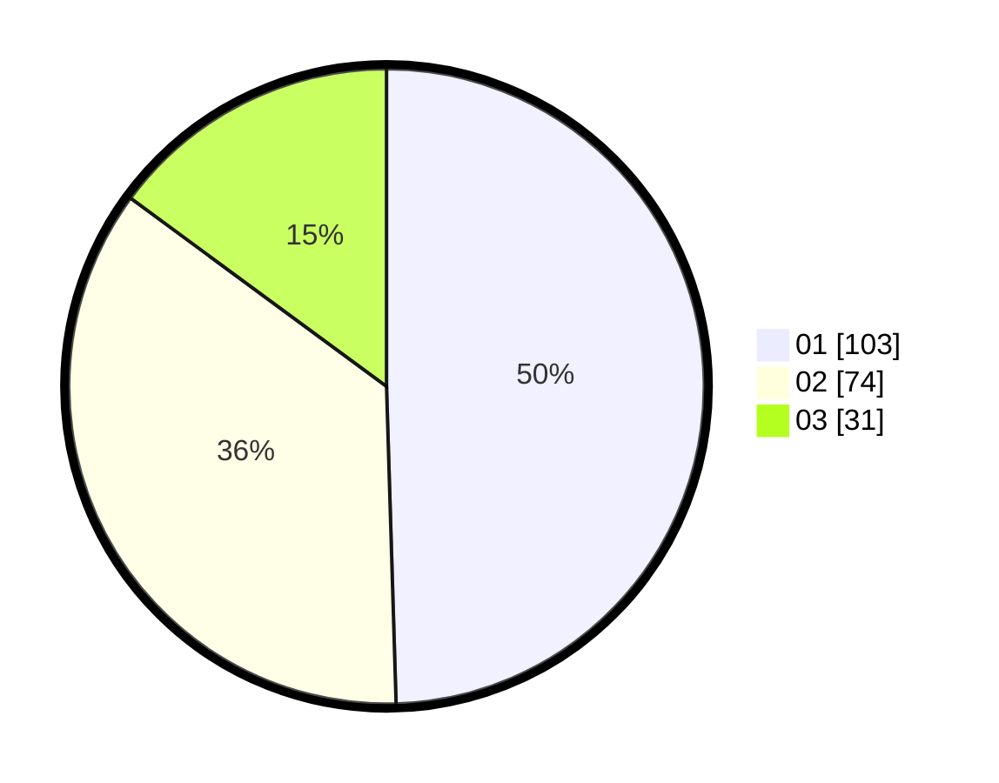

# Hasil

Hasil perolehan suara paslon dapat dilihat pada file paslon-01.txt, paslon-02.txt, dan paslon-03.txt.

Jika tidak ada, artinya data tersebut belum ada pada SIREKAP.

## Perolehan Suara

 * Paslon 01: **103**.
 * Paslon 02: **74**.
 * Paslon 03: **31**.

## Foto C Plano

https://sirekap-obj-formc.kpu.go.id/ab9a/pemilu/ppwp/31/75/07/10/02/3175071002163-20240214-221527--04220d54-546c-4d8f-b796-04b9b51fcf9d.jpg

https://sirekap-obj-formc.kpu.go.id/ab9a/pemilu/ppwp/31/75/07/10/02/3175071002163-20240214-221630--fad84717-5ee3-4bce-90ed-9babe178f311.jpg

https://sirekap-obj-formc.kpu.go.id/ab9a/pemilu/ppwp/31/75/07/10/02/3175071002163-20240214-221728--351f395e-1eb2-4774-9b58-27d2fb291a7d.jpg
