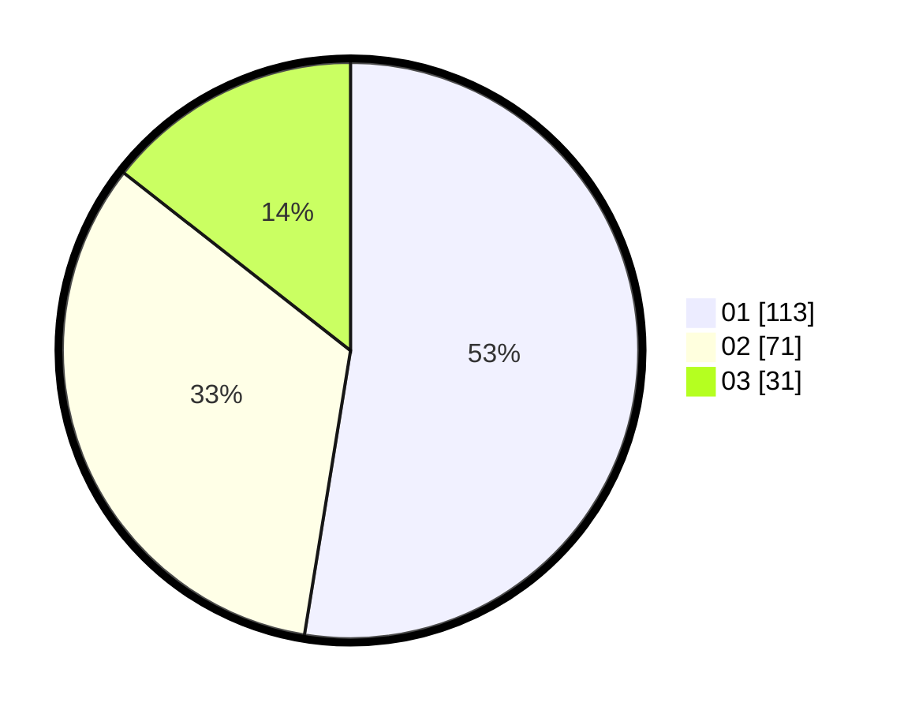

# Hasil

Hasil perolehan suara paslon dapat dilihat pada file paslon-01.txt, paslon-02.txt, dan paslon-03.txt.

Jika tidak ada, artinya data tersebut belum ada pada SIREKAP.

## Perolehan Suara

 * Paslon 01: **113**.
 * Paslon 02: **71**.
 * Paslon 03: **31**.

## Foto C Plano

https://sirekap-obj-formc.kpu.go.id/291f/pemilu/ppwp/31/75/07/10/02/3175071002166-20240214-222451--7126419f-7050-46b1-bdef-efbaf145254a.jpg

https://sirekap-obj-formc.kpu.go.id/291f/pemilu/ppwp/31/75/07/10/02/3175071002166-20240214-222613--88100bd5-611e-448c-ba40-bd6d176b6c9d.jpg

https://sirekap-obj-formc.kpu.go.id/291f/pemilu/ppwp/31/75/07/10/02/3175071002166-20240214-214419--71271d94-1f55-49da-b2c7-26fd8b13e522.jpg
