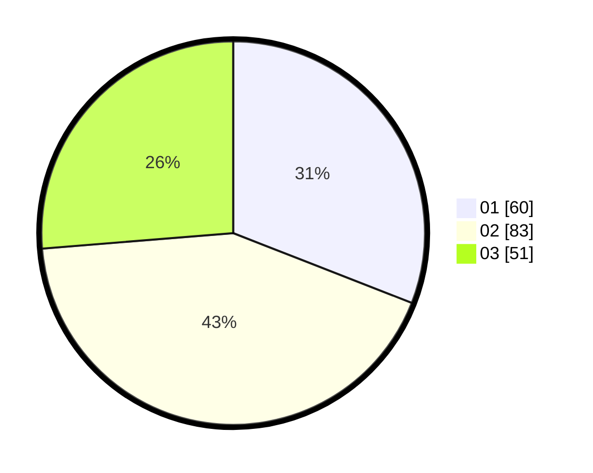

# Hasil

Hasil perolehan suara paslon dapat dilihat pada file paslon-01.txt, paslon-02.txt, dan paslon-03.txt.

Jika tidak ada, artinya data tersebut belum ada pada SIREKAP.

## Perolehan Suara

 * Paslon 01: **60**.
 * Paslon 02: **83**.
 * Paslon 03: **51**.

## Foto C Plano

https://sirekap-obj-formc.kpu.go.id/f2c8/pemilu/ppwp/31/75/07/10/02/3175071002167-20240214-220749--7c0116ef-b9fb-4449-9c96-359cde45a3eb.jpg

https://sirekap-obj-formc.kpu.go.id/f2c8/pemilu/ppwp/31/75/07/10/02/3175071002167-20240214-225926--a43adc71-ddf7-4687-be4e-78b54252d79b.jpg

https://sirekap-obj-formc.kpu.go.id/f2c8/pemilu/ppwp/31/75/07/10/02/3175071002167-20240214-230024--5a53cb11-2b22-44df-9c0d-02863fb4cd70.jpg
