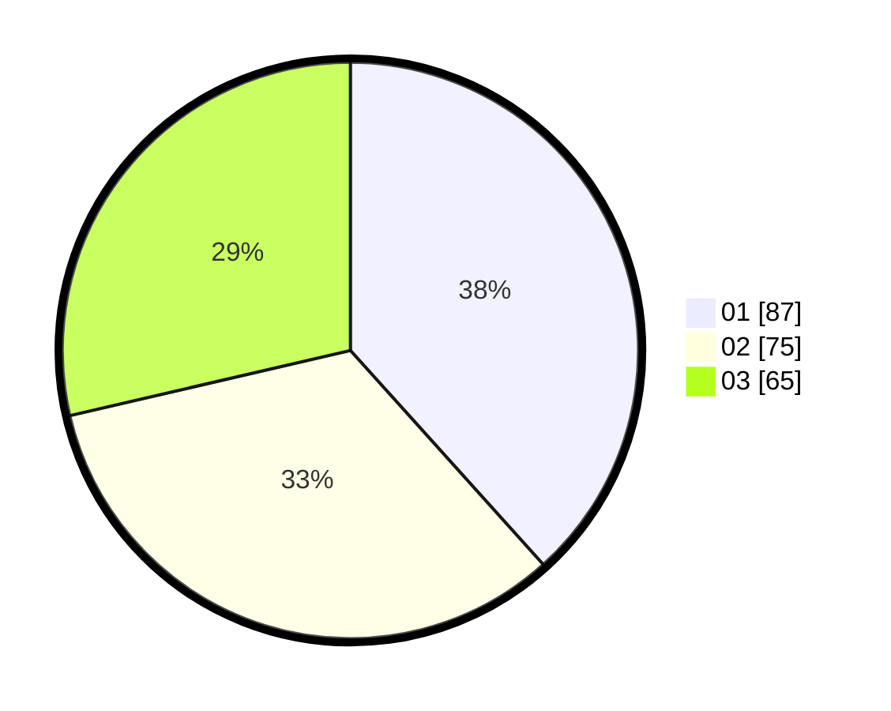

# Hasil

Hasil perolehan suara paslon dapat dilihat pada file paslon-01.txt, paslon-02.txt, dan paslon-03.txt.

Jika tidak ada, artinya data tersebut belum ada pada SIREKAP.

## Perolehan Suara

 * Paslon 01: **87**.
 * Paslon 02: **75**.
 * Paslon 03: **65**.

## Foto C Plano

https://sirekap-obj-formc.kpu.go.id/cb5c/pemilu/ppwp/31/75/07/10/02/3175071002170-20240214-193817--9e67320d-dfa2-4dd9-9be3-1aad229ebeb1.jpg

https://sirekap-obj-formc.kpu.go.id/cb5c/pemilu/ppwp/31/75/07/10/02/3175071002170-20240214-193839--b6ec1fbb-d08b-434c-8ea7-0d2ebed6ce89.jpg

https://sirekap-obj-formc.kpu.go.id/cb5c/pemilu/ppwp/31/75/07/10/02/3175071002170-20240214-193843--e94e1c24-340e-4a54-8440-63a85042f8d3.jpg

## DATA PEMILIH TETAP

Jumlah pemilih dalam DPT: **267**.
 * L: **123**.
 * P: **144**.

## DATA PENGGUNA HAK PILIH

Jumlah pengguna hak pilih dalam DPT: **223**.
 * L: **103**.
 * P: **120**.

Jumlah pengguna hak pilih dalam DPTb: **4**.
 * L: **2**.
 * P: **2**.

Jumlah pengguna hak pilih dalam DPK: **2**.
 * L: **1**.
 * P: **1**.

Jumlah pengguna hak pilih: **229**.
 * L: **106**.
 * P: **123**.

## JUMLAH SUARA SAH DAN TIDAK SAH

JUMLAH SELURUH SUARA SAH: **227**.

JUMLAH SUARA TIDAK SAH: **2**.

JUMLAH SELURUH SUARA SAH DAN SUARA TIDAK SAH: **229**.
