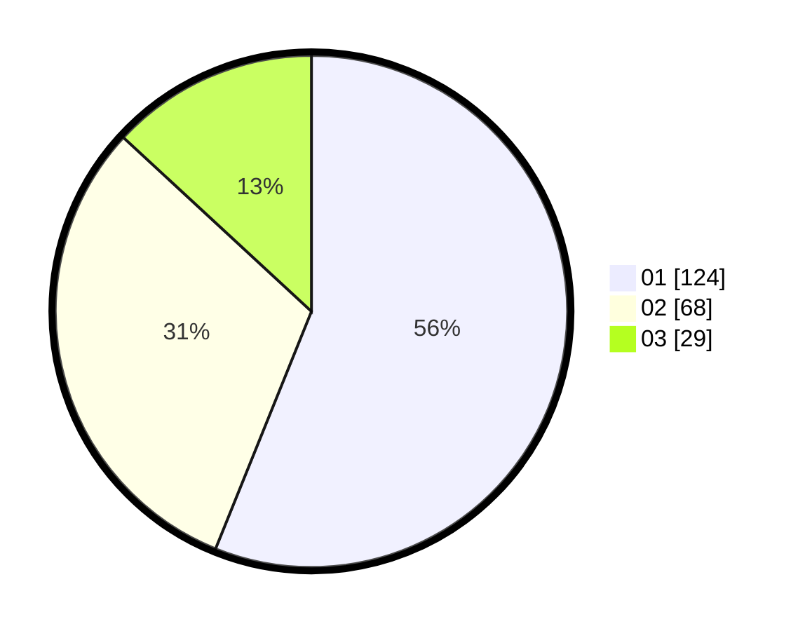

# Hasil

Hasil perolehan suara paslon dapat dilihat pada file paslon-01.txt, paslon-02.txt, dan paslon-03.txt.

Jika tidak ada, artinya data tersebut belum ada pada SIREKAP.

## Perolehan Suara

 * Paslon 01: **124**.
 * Paslon 02: **68**.
 * Paslon 03: **29**.

## Foto C Plano

https://sirekap-obj-formc.kpu.go.id/41eb/pemilu/ppwp/31/75/07/10/02/3175071002174-20240214-185846--550606fd-8473-4ec9-8cd9-d466f461bebb.jpg

https://sirekap-obj-formc.kpu.go.id/41eb/pemilu/ppwp/31/75/07/10/02/3175071002174-20240214-185952--8f2676e4-2fd8-4a3a-adca-9be500901deb.jpg

https://sirekap-obj-formc.kpu.go.id/41eb/pemilu/ppwp/31/75/07/10/02/3175071002174-20240214-200110--29874194-56ad-4926-86e9-d448d433014e.jpg

## DATA PEMILIH TETAP

Jumlah pemilih dalam DPT: **259**.
 * L: **124**.
 * P: **135**.

## DATA PENGGUNA HAK PILIH

Jumlah pengguna hak pilih dalam DPT: **223**.
 * L: **102**.
 * P: **121**.

Jumlah pengguna hak pilih dalam DPTb: **0**.
 * L: **0**.
 * P: **0**.

Jumlah pengguna hak pilih dalam DPK: **2**.
 * L: **1**.
 * P: **1**.

Jumlah pengguna hak pilih: **225**.
 * L: **103**.
 * P: **122**.

## JUMLAH SUARA SAH DAN TIDAK SAH

JUMLAH SELURUH SUARA SAH: **221**.

JUMLAH SUARA TIDAK SAH: **4**.

JUMLAH SELURUH SUARA SAH DAN SUARA TIDAK SAH: **225**.
