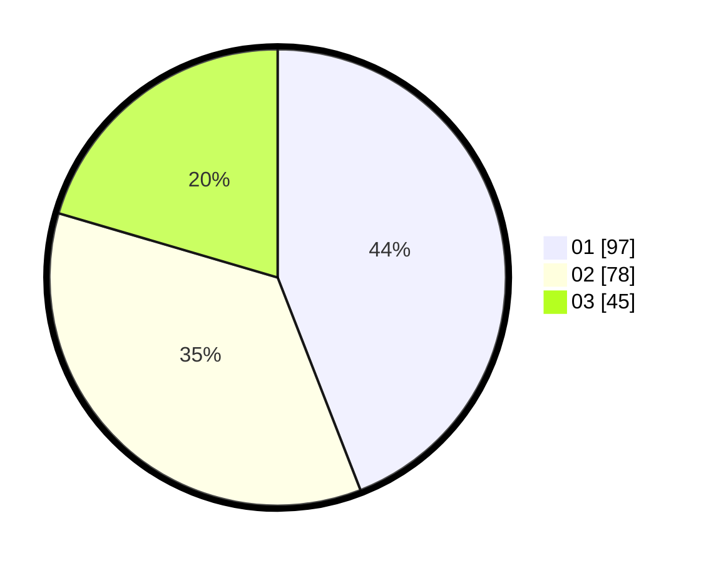

# Hasil

Hasil perolehan suara paslon dapat dilihat pada file paslon-01.txt, paslon-02.txt, dan paslon-03.txt.

Jika tidak ada, artinya data tersebut belum ada pada SIREKAP.

## Perolehan Suara

 * Paslon 01: **97**.
 * Paslon 02: **78**.
 * Paslon 03: **45**.

## Foto C Plano

https://sirekap-obj-formc.kpu.go.id/7357/pemilu/ppwp/31/75/07/10/02/3175071002175-20240214-190706--4152dccb-3952-4642-80d2-fb82073fadb9.jpg

https://sirekap-obj-formc.kpu.go.id/7357/pemilu/ppwp/31/75/07/10/02/3175071002175-20240214-160122--093ffc75-f5b8-47aa-91ac-119d44168333.jpg

https://sirekap-obj-formc.kpu.go.id/7357/pemilu/ppwp/31/75/07/10/02/3175071002175-20240214-190834--17010a0d-c4fd-419a-a9b3-6c19cfa82a3a.jpg

## DATA PEMILIH TETAP

Jumlah pemilih dalam DPT: **259**.
 * L: **124**.
 * P: **135**.

## DATA PENGGUNA HAK PILIH

Jumlah pengguna hak pilih dalam DPT: **212**.
 * L: **100**.
 * P: **112**.

Jumlah pengguna hak pilih dalam DPTb: **7**.
 * L: **0**.
 * P: **7**.

Jumlah pengguna hak pilih dalam DPK: **5**.
 * L: **2**.
 * P: **3**.

Jumlah pengguna hak pilih: **224**.
 * L: **102**.
 * P: **122**.

## JUMLAH SUARA SAH DAN TIDAK SAH

JUMLAH SELURUH SUARA SAH: **220**.

JUMLAH SUARA TIDAK SAH: **4**.

JUMLAH SELURUH SUARA SAH DAN SUARA TIDAK SAH: **224**.
