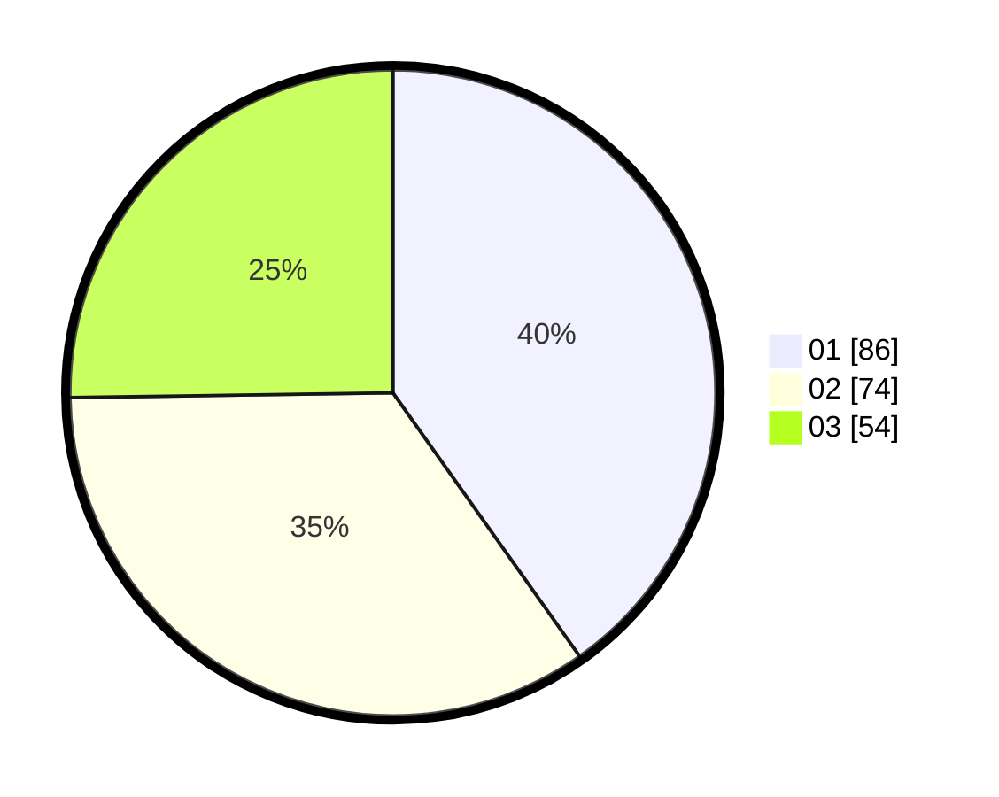

# Hasil

Hasil perolehan suara paslon dapat dilihat pada file paslon-01.txt, paslon-02.txt, dan paslon-03.txt.

Jika tidak ada, artinya data tersebut belum ada pada SIREKAP.

## Perolehan Suara

 * Paslon 01: **86**.
 * Paslon 02: **74**.
 * Paslon 03: **54**.

## Foto C Plano

https://sirekap-obj-formc.kpu.go.id/a462/pemilu/ppwp/31/75/07/10/02/3175071002176-20240215-012658--4f92030f-d1d7-4b3d-a1a6-67e08a8466d9.jpg

https://sirekap-obj-formc.kpu.go.id/a462/pemilu/ppwp/31/75/07/10/02/3175071002176-20240215-012839--d8aa09e6-f324-4e23-99de-5e8a84667414.jpg

https://sirekap-obj-formc.kpu.go.id/a462/pemilu/ppwp/31/75/07/10/02/3175071002176-20240215-012954--8bd61ca3-ee29-4b12-b306-ac6116d7bd0f.jpg

## DATA PEMILIH TETAP

Jumlah pemilih dalam DPT: **268**.
 * L: **136**.
 * P: **132**.

## DATA PENGGUNA HAK PILIH

Jumlah pengguna hak pilih dalam DPT: **216**.
 * L: **103**.
 * P: **113**.

Jumlah pengguna hak pilih dalam DPTb: **0**.
 * L: **0**.
 * P: **0**.

Jumlah pengguna hak pilih dalam DPK: **0**.
 * L: **0**.
 * P: **0**.

Jumlah pengguna hak pilih: **216**.
 * L: **103**.
 * P: **113**.

## JUMLAH SUARA SAH DAN TIDAK SAH

JUMLAH SELURUH SUARA SAH: **214**.

JUMLAH SUARA TIDAK SAH: **2**.

JUMLAH SELURUH SUARA SAH DAN SUARA TIDAK SAH: **216**.
