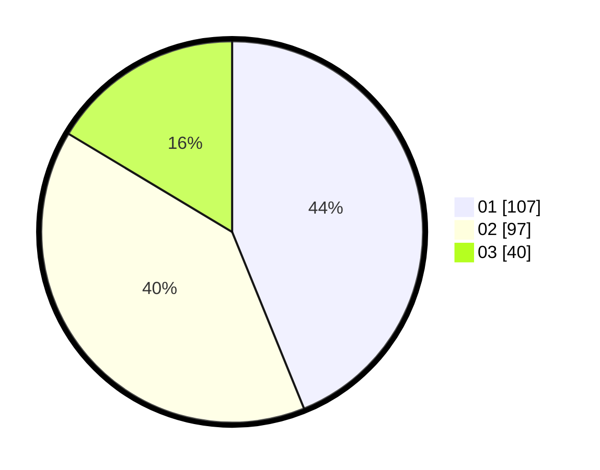

# Hasil

Hasil perolehan suara paslon dapat dilihat pada file paslon-01.txt, paslon-02.txt, dan paslon-03.txt.

Jika tidak ada, artinya data tersebut belum ada pada SIREKAP.

## Perolehan Suara

 * Paslon 01: **107**.
 * Paslon 02: **97**.
 * Paslon 03: **40**.

## Foto C Plano

https://sirekap-obj-formc.kpu.go.id/ffec/pemilu/ppwp/31/75/07/10/02/3175071002181-20240214-204059--67042846-8efc-4a48-af42-b69a5d9ed9db.jpg

https://sirekap-obj-formc.kpu.go.id/ffec/pemilu/ppwp/31/75/07/10/02/3175071002181-20240214-204842--3cdb4cda-6633-4ac9-b690-d820054a9daf.jpg

https://sirekap-obj-formc.kpu.go.id/ffec/pemilu/ppwp/31/75/07/10/02/3175071002181-20240217-093749--0cefc3f5-06e3-4009-9a73-3ba9ca0cb812.jpg
