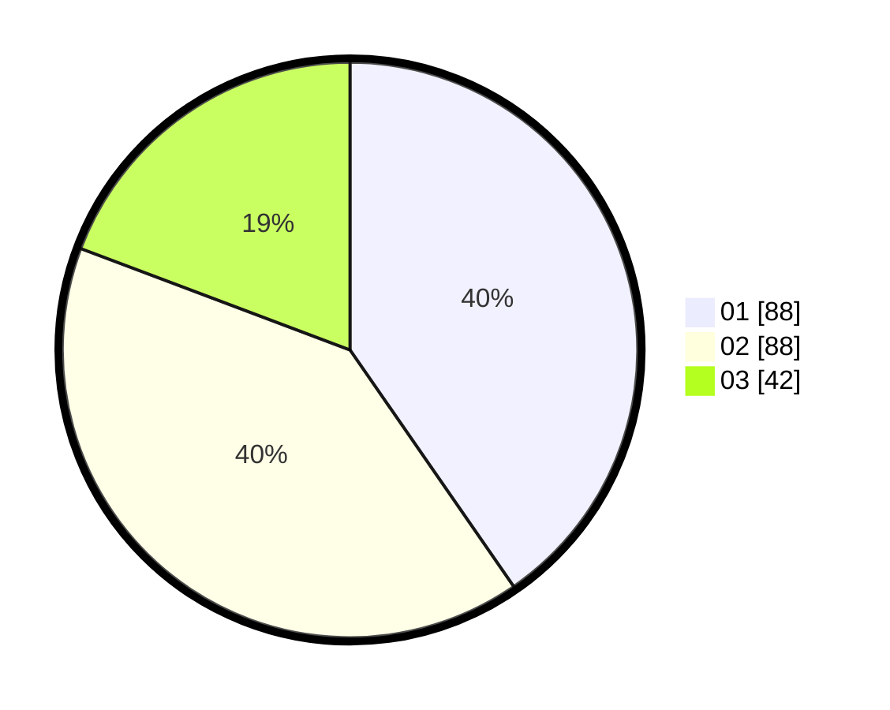

# Hasil

Hasil perolehan suara paslon dapat dilihat pada file paslon-01.txt, paslon-02.txt, dan paslon-03.txt.

Jika tidak ada, artinya data tersebut belum ada pada SIREKAP.

## Perolehan Suara

 * Paslon 01: **88**.
 * Paslon 02: **88**.
 * Paslon 03: **42**.

## Foto C Plano

https://sirekap-obj-formc.kpu.go.id/bbb5/pemilu/ppwp/31/75/07/10/02/3175071002182-20240214-194306--22f57584-e778-42e5-8dff-10951c34d87d.jpg

https://sirekap-obj-formc.kpu.go.id/bbb5/pemilu/ppwp/31/75/07/10/02/3175071002182-20240214-194309--b3a551d2-e0a6-46f1-ba15-a3f3308785d9.jpg

https://sirekap-obj-formc.kpu.go.id/bbb5/pemilu/ppwp/31/75/07/10/02/3175071002182-20240216-034734--5821e3d4-a4fa-4165-95ff-bfd52292fe01.jpg

## DATA PEMILIH TETAP

Jumlah pemilih dalam DPT: **285**.
 * L: **139**.
 * P: **146**.

## DATA PENGGUNA HAK PILIH

Jumlah pengguna hak pilih dalam DPT: **217**.
 * L: **100**.
 * P: **117**.

Jumlah pengguna hak pilih dalam DPTb: **1**.
 * L: **1**.
 * P: **0**.

Jumlah pengguna hak pilih dalam DPK: **1**.
 * L: **1**.
 * P: **0**.

Jumlah pengguna hak pilih: **219**.
 * L: **102**.
 * P: **117**.

## JUMLAH SUARA SAH DAN TIDAK SAH

JUMLAH SELURUH SUARA SAH: **218**.

JUMLAH SUARA TIDAK SAH: **1**.

JUMLAH SELURUH SUARA SAH DAN SUARA TIDAK SAH: **219**.
