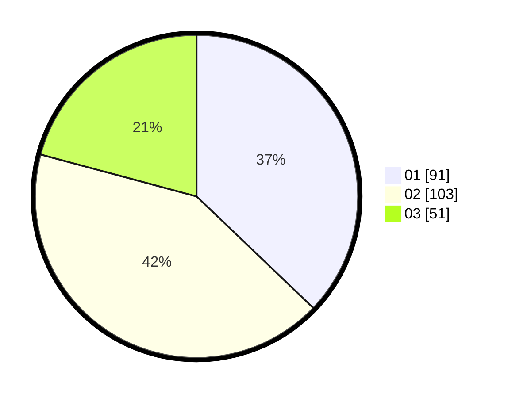

# Hasil

Hasil perolehan suara paslon dapat dilihat pada file paslon-01.txt, paslon-02.txt, dan paslon-03.txt.

Jika tidak ada, artinya data tersebut belum ada pada SIREKAP.

## Perolehan Suara

 * Paslon 01: **91**.
 * Paslon 02: **103**.
 * Paslon 03: **51**.

## Foto C Plano

https://sirekap-obj-formc.kpu.go.id/b829/pemilu/ppwp/31/75/07/10/02/3175071002184-20240216-142931--dcec5ce3-9b4c-4e00-81d8-32d82a250142.jpg

https://sirekap-obj-formc.kpu.go.id/b829/pemilu/ppwp/31/75/07/10/02/3175071002184-20240215-051731--10d08f9b-eee4-4af1-b8d1-f30e7421bae2.jpg

https://sirekap-obj-formc.kpu.go.id/b829/pemilu/ppwp/31/75/07/10/02/3175071002184-20240216-142932--7e5cb313-54c2-4127-9e0f-4514cc1c35bc.jpg

## DATA PEMILIH TETAP

Jumlah pemilih dalam DPT: **270**.
 * L: **135**.
 * P: **135**.

## DATA PENGGUNA HAK PILIH

Jumlah pengguna hak pilih dalam DPT: **217**.
 * L: **107**.
 * P: **110**.

Jumlah pengguna hak pilih dalam DPTb: **3**.
 * L: **1**.
 * P: **2**.

Jumlah pengguna hak pilih dalam DPK: **27**.
 * L: **2**.
 * P: **25**.

Jumlah pengguna hak pilih: **247**.
 * L: **110**.
 * P: **137**.

## JUMLAH SUARA SAH DAN TIDAK SAH

JUMLAH SELURUH SUARA SAH: **245**.

JUMLAH SUARA TIDAK SAH: **2**.

JUMLAH SELURUH SUARA SAH DAN SUARA TIDAK SAH: **247**.
