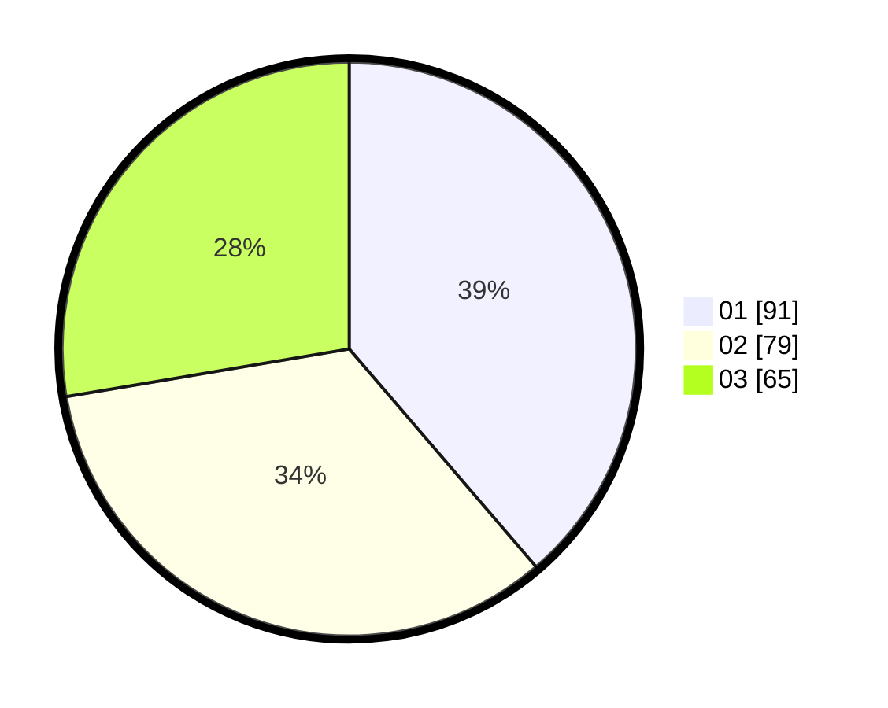

# Hasil

Hasil perolehan suara paslon dapat dilihat pada file paslon-01.txt, paslon-02.txt, dan paslon-03.txt.

Jika tidak ada, artinya data tersebut belum ada pada SIREKAP.

## Perolehan Suara

 * Paslon 01: **91**.
 * Paslon 02: **79**.
 * Paslon 03: **65**.

## Foto C Plano

https://sirekap-obj-formc.kpu.go.id/ad43/pemilu/ppwp/31/75/07/10/02/3175071002189-20240215-014056--31908a7e-135b-4e86-b329-c4981d9ee978.jpg

https://sirekap-obj-formc.kpu.go.id/ad43/pemilu/ppwp/31/75/07/10/02/3175071002189-20240215-014155--418fc06c-d767-40d7-81b8-a19370fd1ce8.jpg

https://sirekap-obj-formc.kpu.go.id/ad43/pemilu/ppwp/31/75/07/10/02/3175071002189-20240215-014306--651852a4-b1e6-44c5-a5f7-b3c9c54fb18c.jpg

## DATA PEMILIH TETAP

Jumlah pemilih dalam DPT: **279**.
 * L: **131**.
 * P: **148**.

## DATA PENGGUNA HAK PILIH

Jumlah pengguna hak pilih dalam DPT: **222**.
 * L: **100**.
 * P: **122**.

Jumlah pengguna hak pilih dalam DPTb: **8**.
 * L: **4**.
 * P: **4**.

Jumlah pengguna hak pilih dalam DPK: **5**.
 * L: **2**.
 * P: **3**.

Jumlah pengguna hak pilih: **235**.
 * L: **106**.
 * P: **129**.

## JUMLAH SUARA SAH DAN TIDAK SAH

JUMLAH SELURUH SUARA SAH: **235**.

JUMLAH SUARA TIDAK SAH: **0**.

JUMLAH SELURUH SUARA SAH DAN SUARA TIDAK SAH: **235**.
