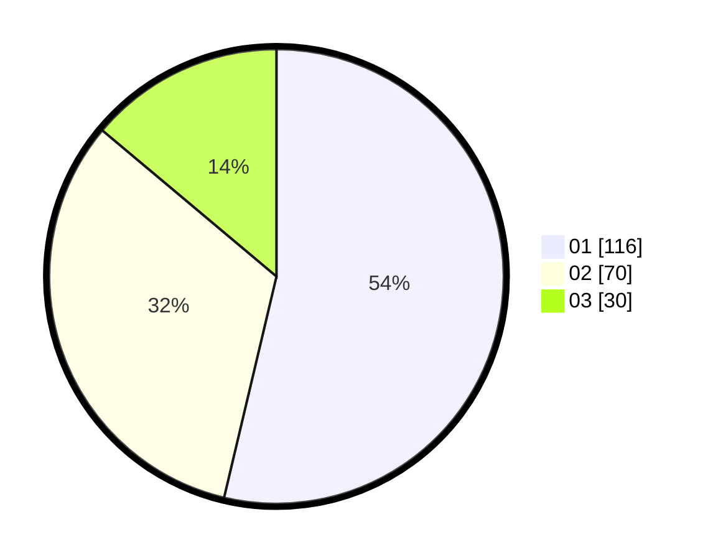

# Hasil

Hasil perolehan suara paslon dapat dilihat pada file paslon-01.txt, paslon-02.txt, dan paslon-03.txt.

Jika tidak ada, artinya data tersebut belum ada pada SIREKAP.

## Perolehan Suara

 * Paslon 01: **116**.
 * Paslon 02: **70**.
 * Paslon 03: **30**.

## Foto C Plano

https://sirekap-obj-formc.kpu.go.id/ba5c/pemilu/ppwp/31/75/07/10/02/3175071002193-20240214-190510--a04666e4-a4b1-4bf1-b522-f8f508183738.jpg

https://sirekap-obj-formc.kpu.go.id/ba5c/pemilu/ppwp/31/75/07/10/02/3175071002193-20240214-193207--d9ad3602-93a9-4447-8f80-5a8e41eb30c7.jpg

https://sirekap-obj-formc.kpu.go.id/ba5c/pemilu/ppwp/31/75/07/10/02/3175071002193-20240214-190530--f2544f28-bfe3-416e-9e0b-3a0c9917606d.jpg

## DATA PEMILIH TETAP

Jumlah pemilih dalam DPT: **262**.
 * L: **133**.
 * P: **129**.

## DATA PENGGUNA HAK PILIH

Jumlah pengguna hak pilih dalam DPT: **218**.
 * L: **109**.
 * P: **109**.

Jumlah pengguna hak pilih dalam DPTb: **0**.
 * L: **0**.
 * P: **0**.

Jumlah pengguna hak pilih dalam DPK: **3**.
 * L: **0**.
 * P: **3**.

Jumlah pengguna hak pilih: **221**.
 * L: **109**.
 * P: **112**.

## JUMLAH SUARA SAH DAN TIDAK SAH

JUMLAH SELURUH SUARA SAH: **216**.

JUMLAH SUARA TIDAK SAH: **5**.

JUMLAH SELURUH SUARA SAH DAN SUARA TIDAK SAH: **221**.
