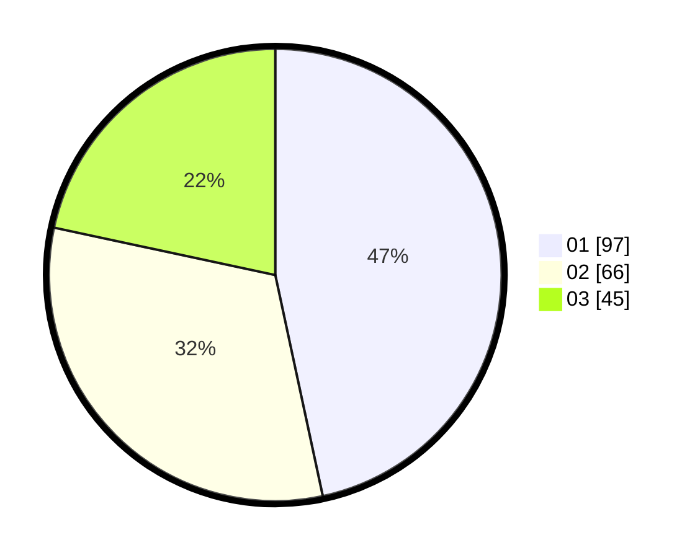

# Hasil

Hasil perolehan suara paslon dapat dilihat pada file paslon-01.txt, paslon-02.txt, dan paslon-03.txt.

Jika tidak ada, artinya data tersebut belum ada pada SIREKAP.

## Perolehan Suara

 * Paslon 01: **97**.
 * Paslon 02: **66**.
 * Paslon 03: **45**.

## Foto C Plano

https://sirekap-obj-formc.kpu.go.id/606f/pemilu/ppwp/31/75/07/10/02/3175071002195-20240215-003325--a4b36f1b-7636-49df-8062-08e644b21fc4.jpg

https://sirekap-obj-formc.kpu.go.id/606f/pemilu/ppwp/31/75/07/10/02/3175071002195-20240215-004002--70a773fc-397a-4573-afc4-e1df746b65ae.jpg

https://sirekap-obj-formc.kpu.go.id/606f/pemilu/ppwp/31/75/07/10/02/3175071002195-20240216-140434--baa1f77b-7dfa-4e59-9ca5-09d07886f623.jpg

## DATA PEMILIH TETAP

Jumlah pemilih dalam DPT: **266**.
 * L: **120**.
 * P: **146**.

## DATA PENGGUNA HAK PILIH

Jumlah pengguna hak pilih dalam DPT: **208**.
 * L: **92**.
 * P: **116**.

Jumlah pengguna hak pilih dalam DPTb: **2**.
 * L: **0**.
 * P: **2**.

Jumlah pengguna hak pilih dalam DPK: **7**.
 * L: **0**.
 * P: **7**.

Jumlah pengguna hak pilih: **211**.
 * L: **92**.
 * P: **119**.

## JUMLAH SUARA SAH DAN TIDAK SAH

JUMLAH SELURUH SUARA SAH: **208**.

JUMLAH SUARA TIDAK SAH: **3**.

JUMLAH SELURUH SUARA SAH DAN SUARA TIDAK SAH: **211**.
