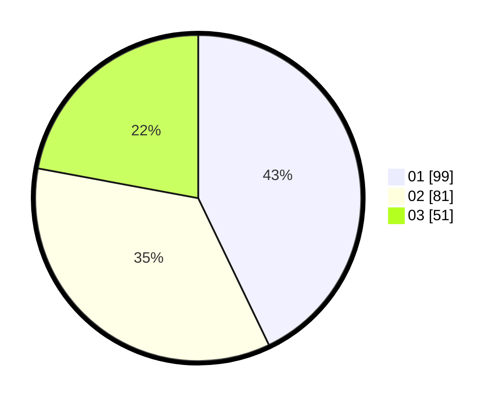

# Hasil

Hasil perolehan suara paslon dapat dilihat pada file paslon-01.txt, paslon-02.txt, dan paslon-03.txt.

Jika tidak ada, artinya data tersebut belum ada pada SIREKAP.

## Perolehan Suara

 * Paslon 01: **99**.
 * Paslon 02: **81**.
 * Paslon 03: **51**.

## Foto C Plano

https://sirekap-obj-formc.kpu.go.id/0d84/pemilu/ppwp/31/75/07/10/02/3175071002199-20240216-121422--7baf859c-5d48-4ed9-ac03-45653ca1b174.jpg

https://sirekap-obj-formc.kpu.go.id/0d84/pemilu/ppwp/31/75/07/10/02/3175071002199-20240216-121425--2fc0f5dd-2247-4959-8056-b2851a2787a3.jpg

https://sirekap-obj-formc.kpu.go.id/0d84/pemilu/ppwp/31/75/07/10/02/3175071002199-20240216-121423--dc5066e3-678e-41e0-bcfc-06c023119852.jpg

## DATA PEMILIH TETAP

Jumlah pemilih dalam DPT: **272**.
 * L: **126**.
 * P: **146**.

## DATA PENGGUNA HAK PILIH

Jumlah pengguna hak pilih dalam DPT: **230**.
 * L: **103**.
 * P: **127**.

Jumlah pengguna hak pilih dalam DPTb: **5**.
 * L: **1**.
 * P: **4**.

Jumlah pengguna hak pilih dalam DPK: **2**.
 * L: **1**.
 * P: **1**.

Jumlah pengguna hak pilih: **237**.
 * L: **105**.
 * P: **132**.

## JUMLAH SUARA SAH DAN TIDAK SAH

JUMLAH SELURUH SUARA SAH: **231**.

JUMLAH SUARA TIDAK SAH: **6**.

JUMLAH SELURUH SUARA SAH DAN SUARA TIDAK SAH: **237**.
