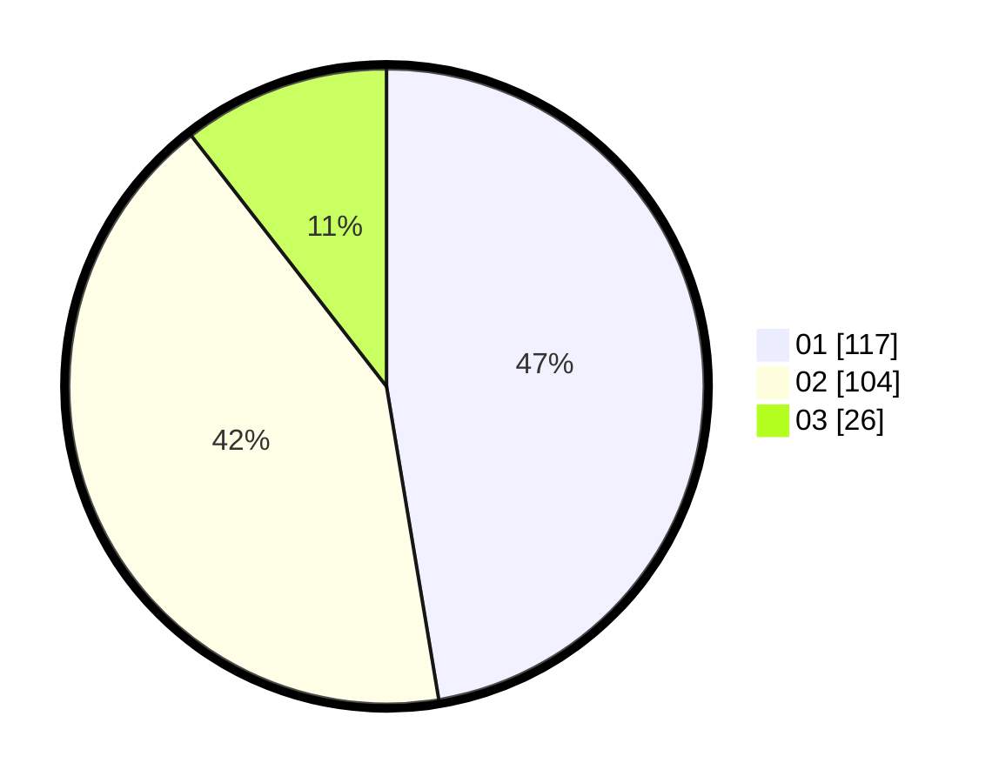

# Hasil

Hasil perolehan suara paslon dapat dilihat pada file paslon-01.txt, paslon-02.txt, dan paslon-03.txt.

Jika tidak ada, artinya data tersebut belum ada pada SIREKAP.

## Perolehan Suara

 * Paslon 01: **117**.
 * Paslon 02: **104**.
 * Paslon 03: **26**.

## Foto C Plano

https://sirekap-obj-formc.kpu.go.id/7760/pemilu/ppwp/31/75/07/10/02/3175071002205-20240216-144556--f5fac11f-83c7-4247-ad12-0da23074362c.jpg

https://sirekap-obj-formc.kpu.go.id/7760/pemilu/ppwp/31/75/07/10/02/3175071002205-20240214-230926--c4db0882-dc55-4e99-9e44-76c01e85c61b.jpg

https://sirekap-obj-formc.kpu.go.id/7760/pemilu/ppwp/31/75/07/10/02/3175071002205-20240214-155916--6dbdb9ab-ab98-4eda-a88f-5152a7d90cda.jpg

## DATA PEMILIH TETAP

Jumlah pemilih dalam DPT: **284**.
 * L: **145**.
 * P: **139**.

## DATA PENGGUNA HAK PILIH

Jumlah pengguna hak pilih dalam DPT: **247**.
 * L: **121**.
 * P: **126**.

Jumlah pengguna hak pilih dalam DPTb: **2**.
 * L: **0**.
 * P: **2**.

Jumlah pengguna hak pilih dalam DPK: **2**.
 * L: **0**.
 * P: **2**.

Jumlah pengguna hak pilih: **251**.
 * L: **121**.
 * P: **130**.

## JUMLAH SUARA SAH DAN TIDAK SAH

JUMLAH SELURUH SUARA SAH: **247**.

JUMLAH SUARA TIDAK SAH: **4**.

JUMLAH SELURUH SUARA SAH DAN SUARA TIDAK SAH: **251**.
