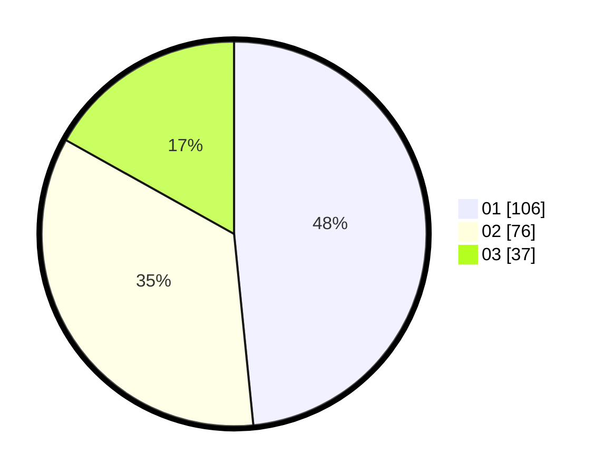

# Hasil

Hasil perolehan suara paslon dapat dilihat pada file paslon-01.txt, paslon-02.txt, dan paslon-03.txt.

Jika tidak ada, artinya data tersebut belum ada pada SIREKAP.

## Perolehan Suara

 * Paslon 01: **106**.
 * Paslon 02: **76**.
 * Paslon 03: **37**.

## Foto C Plano

https://sirekap-obj-formc.kpu.go.id/bf37/pemilu/ppwp/31/75/07/10/02/3175071002211-20240217-085018--07acea80-4c88-437e-b319-4ba4b30668ee.jpg

https://sirekap-obj-formc.kpu.go.id/bf37/pemilu/ppwp/31/75/07/10/02/3175071002211-20240214-193006--42310e60-68fa-47de-83ab-278aeb8f43bf.jpg

https://sirekap-obj-formc.kpu.go.id/bf37/pemilu/ppwp/31/75/07/10/02/3175071002211-20240214-193011--0f88e970-1ce7-407b-862e-cf608e261226.jpg
