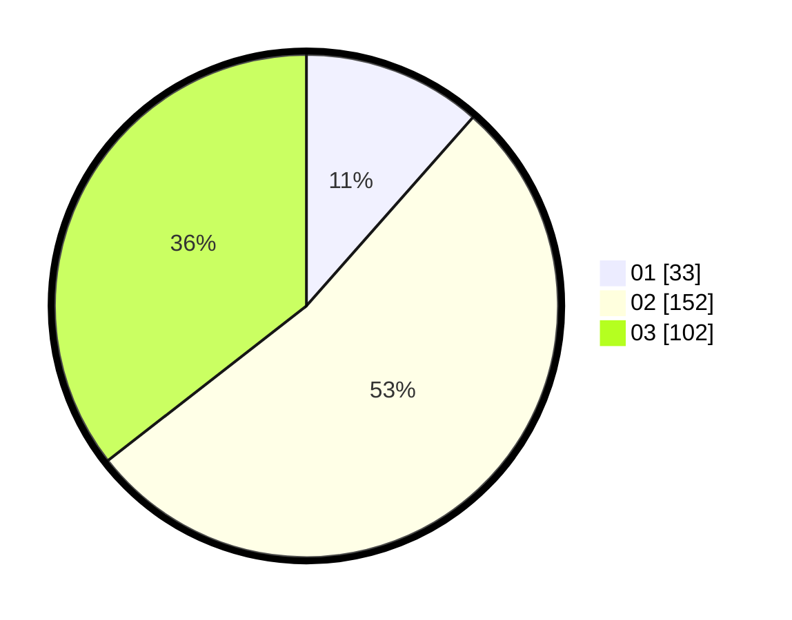

# Hasil

Hasil perolehan suara paslon dapat dilihat pada file paslon-01.txt, paslon-02.txt, dan paslon-03.txt.

Jika tidak ada, artinya data tersebut belum ada pada SIREKAP.

## Perolehan Suara

 * Paslon 01: **33**.
 * Paslon 02: **152**.
 * Paslon 03: **102**.

## Foto C Plano

https://sirekap-obj-formc.kpu.go.id/edd1/pemilu/ppwp/31/75/07/10/02/3175071002901-20240214-223125--8955051a-0415-40a8-8e9a-dcb2b4a2700d.jpg

https://sirekap-obj-formc.kpu.go.id/edd1/pemilu/ppwp/31/75/07/10/02/3175071002901-20240214-205457--924a3670-87f4-43f9-8e8d-b957bf8525f0.jpg

https://sirekap-obj-formc.kpu.go.id/edd1/pemilu/ppwp/31/75/07/10/02/3175071002901-20240214-205548--09c7e494-c82b-4a43-81ac-fc670c33fa1f.jpg

## DATA PEMILIH TETAP

Jumlah pemilih dalam DPT: **283**.
 * L: **6**.
 * P: **277**.

## DATA PENGGUNA HAK PILIH

Jumlah pengguna hak pilih dalam DPT: **172**.
 * L: **6**.
 * P: **166**.

Jumlah pengguna hak pilih dalam DPTb: **119**.
 * L: **7**.
 * P: **118**.

Jumlah pengguna hak pilih dalam DPK: **0**.
 * L: **0**.
 * P: **0**.

Jumlah pengguna hak pilih: **291**.
 * L: **0**.
 * P: **0**.

## JUMLAH SUARA SAH DAN TIDAK SAH

JUMLAH SELURUH SUARA SAH: **287**.

JUMLAH SUARA TIDAK SAH: **4**.

JUMLAH SELURUH SUARA SAH DAN SUARA TIDAK SAH: **291**.
