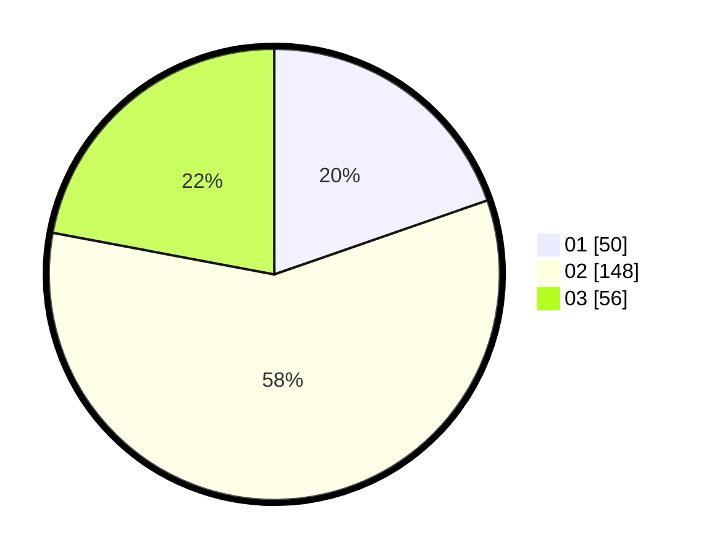

# Hasil

Hasil perolehan suara paslon dapat dilihat pada file paslon-01.txt, paslon-02.txt, dan paslon-03.txt.

Jika tidak ada, artinya data tersebut belum ada pada SIREKAP.

## Perolehan Suara

 * Paslon 01: **50**.
 * Paslon 02: **148**.
 * Paslon 03: **56**.

## Foto C Plano

https://sirekap-obj-formc.kpu.go.id/92a8/pemilu/ppwp/31/75/07/10/02/3175071002902-20240214-221752--c7fbab5d-d9e1-4450-a63f-c6e71dd14e08.jpg

https://sirekap-obj-formc.kpu.go.id/92a8/pemilu/ppwp/31/75/07/10/02/3175071002902-20240214-211054--17421f24-c142-415f-8fe3-ab4a78123c33.jpg

https://sirekap-obj-formc.kpu.go.id/92a8/pemilu/ppwp/31/75/07/10/02/3175071002902-20240214-223553--1d6e2762-00ba-4973-8888-f4ef0e46d3e3.jpg
