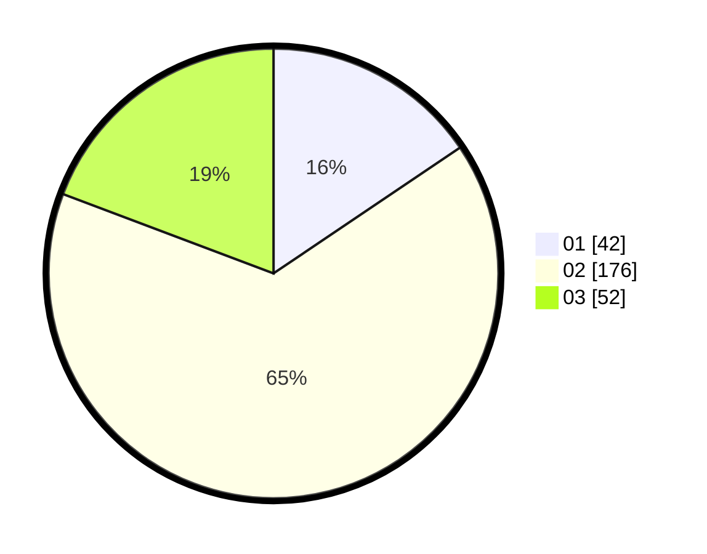

# Hasil

Hasil perolehan suara paslon dapat dilihat pada file paslon-01.txt, paslon-02.txt, dan paslon-03.txt.

Jika tidak ada, artinya data tersebut belum ada pada SIREKAP.

## Perolehan Suara

 * Paslon 01: **42**.
 * Paslon 02: **176**.
 * Paslon 03: **52**.

## Foto C Plano

https://sirekap-obj-formc.kpu.go.id/a3e4/pemilu/ppwp/31/75/07/10/02/3175071002903-20240214-155806--793dabe5-214e-4205-8c8b-528257effc17.jpg

https://sirekap-obj-formc.kpu.go.id/a3e4/pemilu/ppwp/31/75/07/10/02/3175071002903-20240214-162221--d1495acc-6823-4e1a-a955-9f1142dbfb20.jpg

https://sirekap-obj-formc.kpu.go.id/a3e4/pemilu/ppwp/31/75/07/10/02/3175071002903-20240214-190322--0fa76275-2997-42c8-a278-837e62cf09e1.jpg

## DATA PEMILIH TETAP

Jumlah pemilih dalam DPT: **271**.
 * L: **0**.
 * P: **271**.

## DATA PENGGUNA HAK PILIH

Jumlah pengguna hak pilih dalam DPT: **85**.
 * L: **0**.
 * P: **85**.

Jumlah pengguna hak pilih dalam DPTb: **186**.
 * L: **0**.
 * P: **186**.

Jumlah pengguna hak pilih dalam DPK: **0**.
 * L: **0**.
 * P: **0**.

Jumlah pengguna hak pilih: **271**.
 * L: **0**.
 * P: **271**.

## JUMLAH SUARA SAH DAN TIDAK SAH

JUMLAH SELURUH SUARA SAH: **271**.

JUMLAH SUARA TIDAK SAH: **1**.

JUMLAH SELURUH SUARA SAH DAN SUARA TIDAK SAH: **271**.
