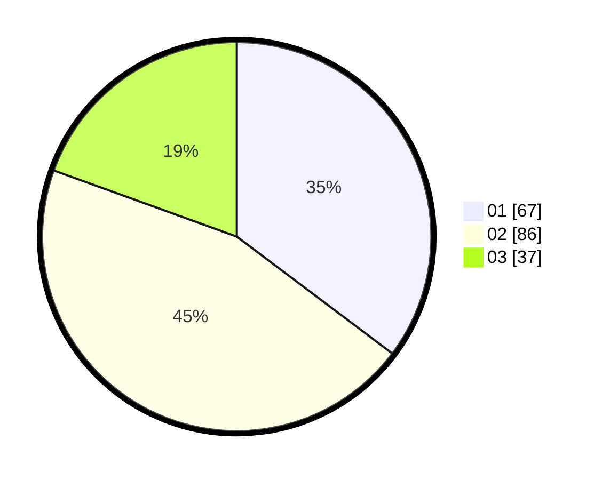

# Hasil

Hasil perolehan suara paslon dapat dilihat pada file paslon-01.txt, paslon-02.txt, dan paslon-03.txt.

Jika tidak ada, artinya data tersebut belum ada pada SIREKAP.

## Perolehan Suara

 * Paslon 01: **67**.
 * Paslon 02: **86**.
 * Paslon 03: **37**.

## Foto C Plano

https://sirekap-obj-formc.kpu.go.id/5fb5/pemilu/ppwp/31/75/07/10/03/3175071003003-20240215-153226--1168f72d-a880-415f-b5a1-4f1c16d29079.jpg

https://sirekap-obj-formc.kpu.go.id/5fb5/pemilu/ppwp/31/75/07/10/03/3175071003003-20240215-081813--fc83696a-b476-46ae-b1dc-1eef50c233d9.jpg

https://sirekap-obj-formc.kpu.go.id/5fb5/pemilu/ppwp/31/75/07/10/03/3175071003003-20240215-081818--8397e01a-633c-40ca-b143-2b6dbfadd02a.jpg
