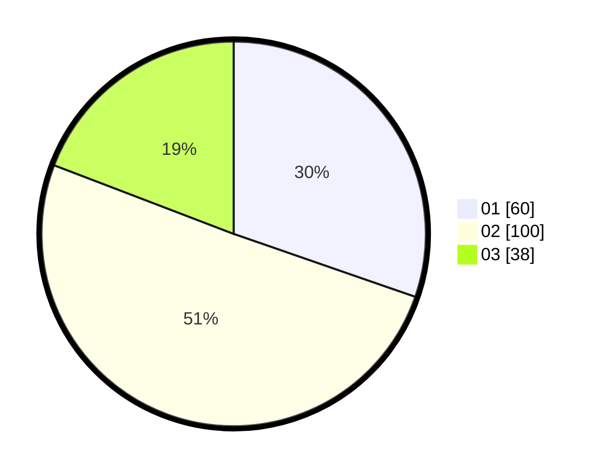

# Hasil

Hasil perolehan suara paslon dapat dilihat pada file paslon-01.txt, paslon-02.txt, dan paslon-03.txt.

Jika tidak ada, artinya data tersebut belum ada pada SIREKAP.

## Perolehan Suara

 * Paslon 01: **60**.
 * Paslon 02: **100**.
 * Paslon 03: **38**.

## Foto C Plano

https://sirekap-obj-formc.kpu.go.id/984c/pemilu/ppwp/31/75/07/10/03/3175071003005-20240215-010630--2efecbf4-fa85-44af-9d2d-84298a85c618.jpg

https://sirekap-obj-formc.kpu.go.id/984c/pemilu/ppwp/31/75/07/10/03/3175071003005-20240215-010715--10a80904-ac9d-4341-b880-d7f825e9df09.jpg

https://sirekap-obj-formc.kpu.go.id/984c/pemilu/ppwp/31/75/07/10/03/3175071003005-20240215-010759--8df21891-95c6-43ce-b1fb-2cde0c93fcba.jpg

## DATA PEMILIH TETAP

Jumlah pemilih dalam DPT: **268**.
 * L: **133**.
 * P: **135**.

## DATA PENGGUNA HAK PILIH

Jumlah pengguna hak pilih dalam DPT: **198**.
 * L: **96**.
 * P: **102**.

Jumlah pengguna hak pilih dalam DPTb: **1**.
 * L: **1**.
 * P: **0**.

Jumlah pengguna hak pilih dalam DPK: **0**.
 * L: **0**.
 * P: **0**.

Jumlah pengguna hak pilih: **199**.
 * L: **97**.
 * P: **102**.

## JUMLAH SUARA SAH DAN TIDAK SAH

JUMLAH SELURUH SUARA SAH: **198**.

JUMLAH SUARA TIDAK SAH: **1**.

JUMLAH SELURUH SUARA SAH DAN SUARA TIDAK SAH: **199**.
