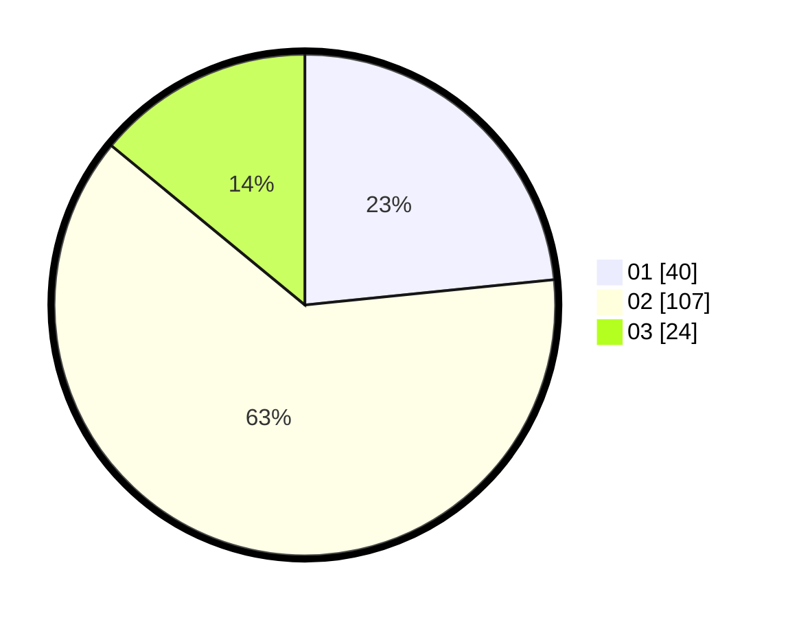

# Hasil

Hasil perolehan suara paslon dapat dilihat pada file paslon-01.txt, paslon-02.txt, dan paslon-03.txt.

Jika tidak ada, artinya data tersebut belum ada pada SIREKAP.

## Perolehan Suara

 * Paslon 01: **40**.
 * Paslon 02: **107**.
 * Paslon 03: **24**.

## Foto C Plano

https://sirekap-obj-formc.kpu.go.id/1053/pemilu/ppwp/31/75/07/10/03/3175071003007-20240214-191127--bf8a721e-8821-4e95-9cb9-e86701cdf4af.jpg

https://sirekap-obj-formc.kpu.go.id/1053/pemilu/ppwp/31/75/07/10/03/3175071003007-20240214-192226--fc5f42b4-d26f-40b8-b4cf-1553d79b1317.jpg

https://sirekap-obj-formc.kpu.go.id/1053/pemilu/ppwp/31/75/07/10/03/3175071003007-20240214-191421--e30bf405-b1fb-4e09-9c53-1c64ee4a8afe.jpg

## DATA PEMILIH TETAP

Jumlah pemilih dalam DPT: **271**.
 * L: **148**.
 * P: **123**.

## DATA PENGGUNA HAK PILIH

Jumlah pengguna hak pilih dalam DPT: **176**.
 * L: **91**.
 * P: **85**.

Jumlah pengguna hak pilih dalam DPTb: **1**.
 * L: **0**.
 * P: **1**.

Jumlah pengguna hak pilih dalam DPK: **0**.
 * L: **0**.
 * P: **0**.

Jumlah pengguna hak pilih: **177**.
 * L: **91**.
 * P: **86**.

## JUMLAH SUARA SAH DAN TIDAK SAH

JUMLAH SELURUH SUARA SAH: **171**.

JUMLAH SUARA TIDAK SAH: **6**.

JUMLAH SELURUH SUARA SAH DAN SUARA TIDAK SAH: **177**.
