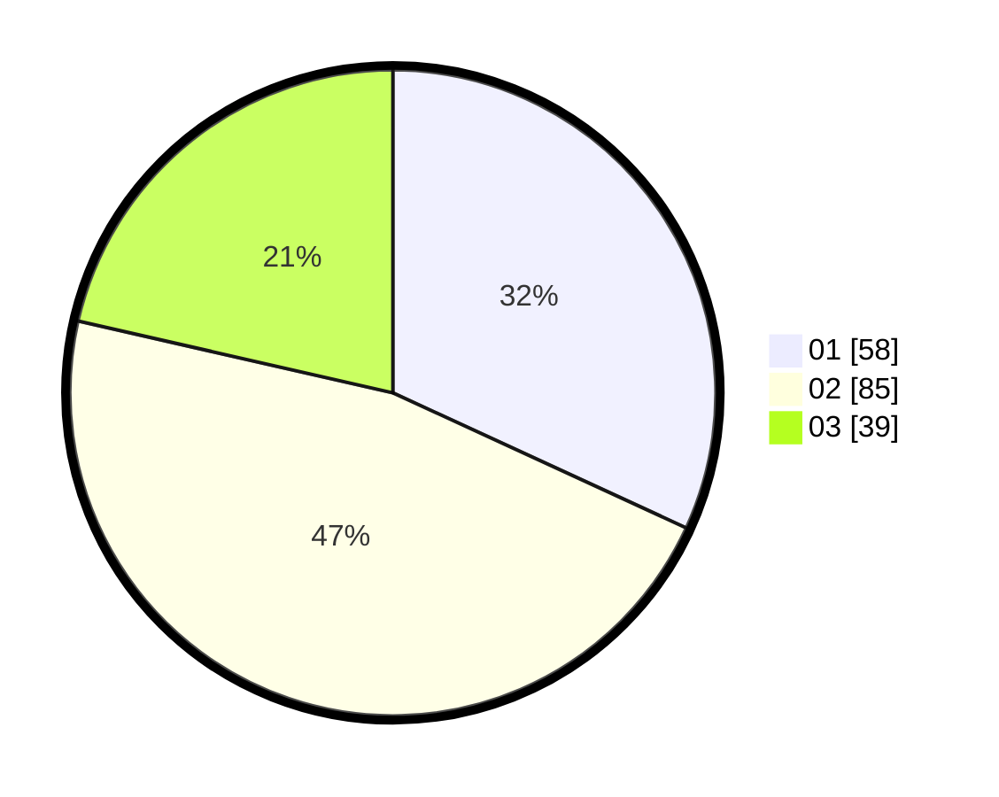

# Hasil

Hasil perolehan suara paslon dapat dilihat pada file paslon-01.txt, paslon-02.txt, dan paslon-03.txt.

Jika tidak ada, artinya data tersebut belum ada pada SIREKAP.

## Perolehan Suara

 * Paslon 01: **58**.
 * Paslon 02: **85**.
 * Paslon 03: **39**.

## Foto C Plano

https://sirekap-obj-formc.kpu.go.id/ab04/pemilu/ppwp/31/75/07/10/03/3175071003008-20240216-024032--45d712e2-91db-4877-ae96-3f599edd31ff.jpg

https://sirekap-obj-formc.kpu.go.id/ab04/pemilu/ppwp/31/75/07/10/03/3175071003008-20240216-024044--8d88444a-295f-4824-b10f-5bfcb0083724.jpg

https://sirekap-obj-formc.kpu.go.id/ab04/pemilu/ppwp/31/75/07/10/03/3175071003008-20240216-024040--c5c69b0c-1461-463e-90e9-212cff81b4c3.jpg

## DATA PEMILIH TETAP

Jumlah pemilih dalam DPT: **269**.
 * L: **136**.
 * P: **133**.

## DATA PENGGUNA HAK PILIH

Jumlah pengguna hak pilih dalam DPT: **182**.
 * L: **87**.
 * P: **95**.

Jumlah pengguna hak pilih dalam DPTb: **2**.
 * L: **2**.
 * P: **0**.

Jumlah pengguna hak pilih dalam DPK: **2**.
 * L: **2**.
 * P: **0**.

Jumlah pengguna hak pilih: **186**.
 * L: **91**.
 * P: **95**.

## JUMLAH SUARA SAH DAN TIDAK SAH

JUMLAH SELURUH SUARA SAH: **182**.

JUMLAH SUARA TIDAK SAH: **5**.

JUMLAH SELURUH SUARA SAH DAN SUARA TIDAK SAH: **187**.
