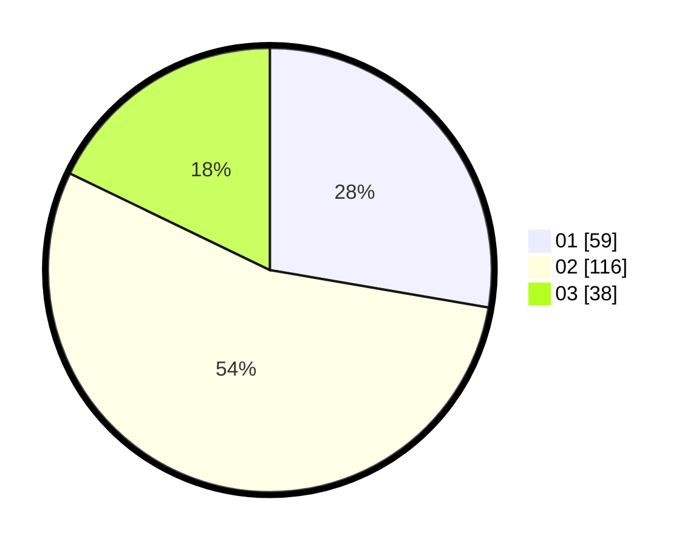

# Hasil

Hasil perolehan suara paslon dapat dilihat pada file paslon-01.txt, paslon-02.txt, dan paslon-03.txt.

Jika tidak ada, artinya data tersebut belum ada pada SIREKAP.

## Perolehan Suara

 * Paslon 01: **59**.
 * Paslon 02: **116**.
 * Paslon 03: **38**.

## Foto C Plano

https://sirekap-obj-formc.kpu.go.id/cb0f/pemilu/ppwp/31/75/07/10/03/3175071003009-20240215-030350--c49eb59c-9545-4e66-bc6d-b94859834da9.jpg

https://sirekap-obj-formc.kpu.go.id/cb0f/pemilu/ppwp/31/75/07/10/03/3175071003009-20240215-032008--e7fd2ef7-2e4f-4c5a-a946-f7ad61dc9520.jpg

https://sirekap-obj-formc.kpu.go.id/cb0f/pemilu/ppwp/31/75/07/10/03/3175071003009-20240215-032246--e2870b12-845b-4ab1-82b5-284a10ecc778.jpg

## DATA PEMILIH TETAP

Jumlah pemilih dalam DPT: **279**.
 * L: **143**.
 * P: **136**.

## DATA PENGGUNA HAK PILIH

Jumlah pengguna hak pilih dalam DPT: **213**.
 * L: **100**.
 * P: **113**.

Jumlah pengguna hak pilih dalam DPTb: **1**.
 * L: **0**.
 * P: **1**.

Jumlah pengguna hak pilih dalam DPK: **4**.
 * L: **2**.
 * P: **2**.

Jumlah pengguna hak pilih: **218**.
 * L: **102**.
 * P: **116**.

## JUMLAH SUARA SAH DAN TIDAK SAH

JUMLAH SELURUH SUARA SAH: **213**.

JUMLAH SUARA TIDAK SAH: **5**.

JUMLAH SELURUH SUARA SAH DAN SUARA TIDAK SAH: **218**.
