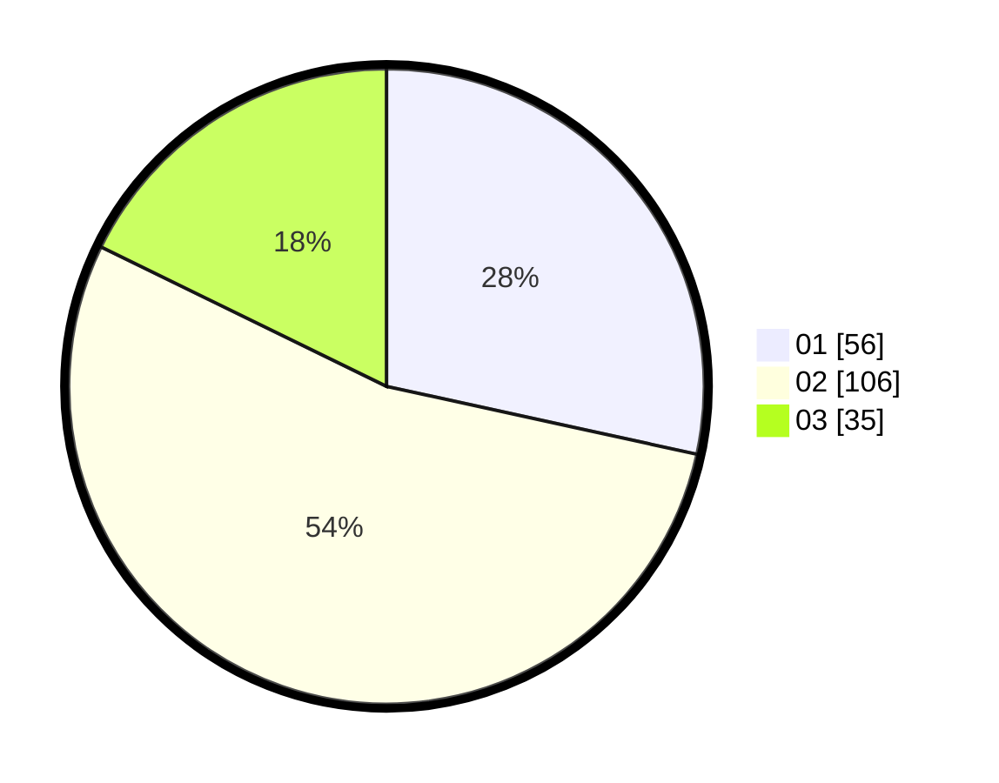

# Hasil

Hasil perolehan suara paslon dapat dilihat pada file paslon-01.txt, paslon-02.txt, dan paslon-03.txt.

Jika tidak ada, artinya data tersebut belum ada pada SIREKAP.

## Perolehan Suara

 * Paslon 01: **56**.
 * Paslon 02: **106**.
 * Paslon 03: **35**.

## Foto C Plano

https://sirekap-obj-formc.kpu.go.id/9bf5/pemilu/ppwp/31/75/07/10/03/3175071003014-20240215-000435--d2d402db-c530-4a77-8b61-4612910604a1.jpg

https://sirekap-obj-formc.kpu.go.id/9bf5/pemilu/ppwp/31/75/07/10/03/3175071003014-20240215-000513--74159626-a18e-4fea-99cf-b8bef201ead6.jpg

https://sirekap-obj-formc.kpu.go.id/9bf5/pemilu/ppwp/31/75/07/10/03/3175071003014-20240215-000612--7616190e-c268-4a68-ba8d-df48966dc4f6.jpg

## DATA PEMILIH TETAP

Jumlah pemilih dalam DPT: **271**.
 * L: **129**.
 * P: **143**.

## DATA PENGGUNA HAK PILIH

Jumlah pengguna hak pilih dalam DPT: **196**.
 * L: **97**.
 * P: **99**.

Jumlah pengguna hak pilih dalam DPTb: **2**.
 * L: **0**.
 * P: **2**.

Jumlah pengguna hak pilih dalam DPK: **2**.
 * L: **0**.
 * P: **2**.

Jumlah pengguna hak pilih: **200**.
 * L: **97**.
 * P: **103**.

## JUMLAH SUARA SAH DAN TIDAK SAH

JUMLAH SELURUH SUARA SAH: **197**.

JUMLAH SUARA TIDAK SAH: **3**.

JUMLAH SELURUH SUARA SAH DAN SUARA TIDAK SAH: **200**.
