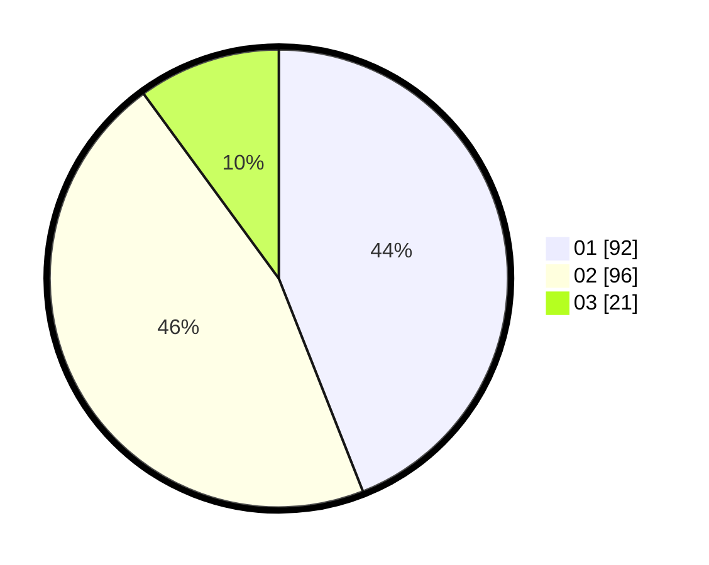

# Hasil

Hasil perolehan suara paslon dapat dilihat pada file paslon-01.txt, paslon-02.txt, dan paslon-03.txt.

Jika tidak ada, artinya data tersebut belum ada pada SIREKAP.

## Perolehan Suara

 * Paslon 01: **92**.
 * Paslon 02: **96**.
 * Paslon 03: **21**.

## Foto C Plano

https://sirekap-obj-formc.kpu.go.id/e972/pemilu/ppwp/31/75/07/10/03/3175071003017-20240215-211235--f0a07023-82a1-4db2-82fd-19e80b1f608c.jpg

https://sirekap-obj-formc.kpu.go.id/e972/pemilu/ppwp/31/75/07/10/03/3175071003017-20240215-211237--74e9493e-a6d4-419e-aa14-1d2e3e418849.jpg

https://sirekap-obj-formc.kpu.go.id/e972/pemilu/ppwp/31/75/07/10/03/3175071003017-20240215-211236--c7180ddf-fc92-4054-9d3d-af0af189b59e.jpg

## DATA PEMILIH TETAP

Jumlah pemilih dalam DPT: **275**.
 * L: **136**.
 * P: **139**.

## DATA PENGGUNA HAK PILIH

Jumlah pengguna hak pilih dalam DPT: **212**.
 * L: **102**.
 * P: **110**.

Jumlah pengguna hak pilih dalam DPTb: **1**.
 * L: **1**.
 * P: **0**.

Jumlah pengguna hak pilih dalam DPK: **0**.
 * L: **0**.
 * P: **0**.

Jumlah pengguna hak pilih: **213**.
 * L: **103**.
 * P: **110**.

## JUMLAH SUARA SAH DAN TIDAK SAH

JUMLAH SELURUH SUARA SAH: **209**.

JUMLAH SUARA TIDAK SAH: **4**.

JUMLAH SELURUH SUARA SAH DAN SUARA TIDAK SAH: **213**.
