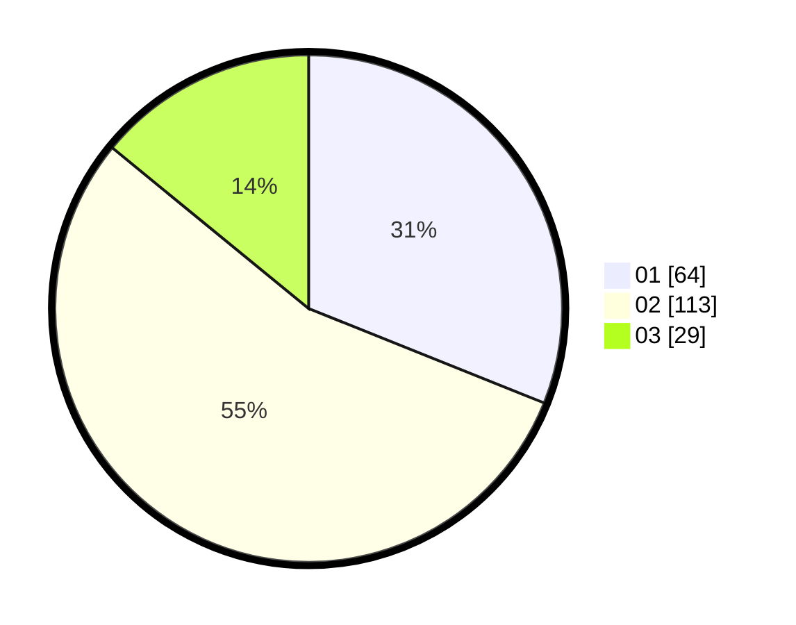

# Hasil

Hasil perolehan suara paslon dapat dilihat pada file paslon-01.txt, paslon-02.txt, dan paslon-03.txt.

Jika tidak ada, artinya data tersebut belum ada pada SIREKAP.

## Perolehan Suara

 * Paslon 01: **64**.
 * Paslon 02: **113**.
 * Paslon 03: **29**.

## Foto C Plano

https://sirekap-obj-formc.kpu.go.id/c83c/pemilu/ppwp/31/75/07/10/03/3175071003027-20240214-162216--215a25b8-105a-460e-8986-93ca384e29c2.jpg

https://sirekap-obj-formc.kpu.go.id/c83c/pemilu/ppwp/31/75/07/10/03/3175071003027-20240214-162223--eec022f5-ce1a-4733-a4bf-579818911fc2.jpg

https://sirekap-obj-formc.kpu.go.id/c83c/pemilu/ppwp/31/75/07/10/03/3175071003027-20240214-162228--3f0ac1f7-50bf-484f-ae6d-f0b61b995b25.jpg
