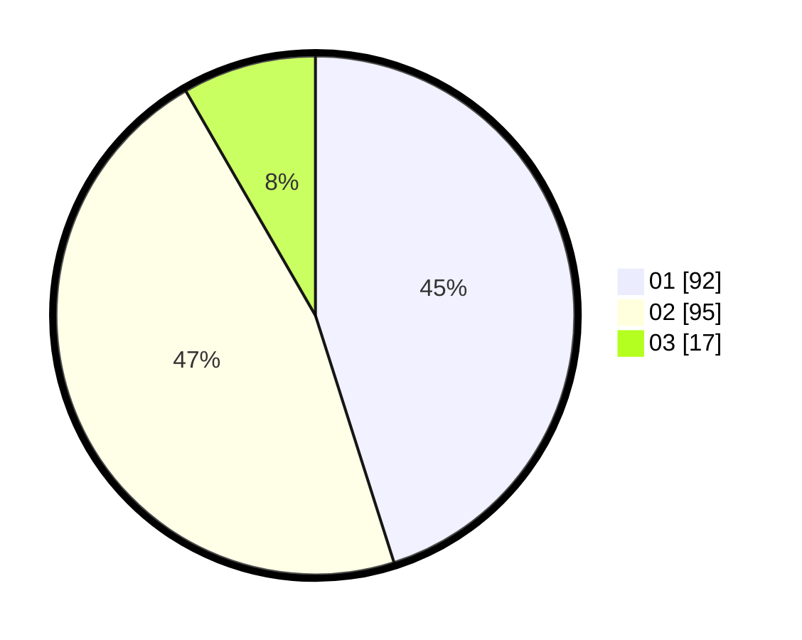

# Hasil

Hasil perolehan suara paslon dapat dilihat pada file paslon-01.txt, paslon-02.txt, dan paslon-03.txt.

Jika tidak ada, artinya data tersebut belum ada pada SIREKAP.

## Perolehan Suara

 * Paslon 01: **92**.
 * Paslon 02: **95**.
 * Paslon 03: **17**.

## Foto C Plano

https://sirekap-obj-formc.kpu.go.id/a754/pemilu/ppwp/31/75/07/10/03/3175071003028-20240214-220732--b89d2379-81fc-49f5-af14-524075f81ac1.jpg

https://sirekap-obj-formc.kpu.go.id/a754/pemilu/ppwp/31/75/07/10/03/3175071003028-20240214-220817--1506c7ee-32c5-458f-9943-0361d0125236.jpg

https://sirekap-obj-formc.kpu.go.id/a754/pemilu/ppwp/31/75/07/10/03/3175071003028-20240214-220650--045f2786-b18e-4a2c-b474-92472b5066cd.jpg
