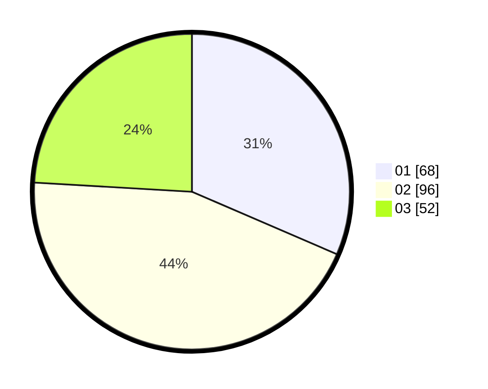

# Hasil

Hasil perolehan suara paslon dapat dilihat pada file paslon-01.txt, paslon-02.txt, dan paslon-03.txt.

Jika tidak ada, artinya data tersebut belum ada pada SIREKAP.

## Perolehan Suara

 * Paslon 01: **68**.
 * Paslon 02: **96**.
 * Paslon 03: **52**.

## Foto C Plano

https://sirekap-obj-formc.kpu.go.id/783a/pemilu/ppwp/31/75/07/10/03/3175071003034-20240216-124442--b02e8086-fc48-431c-9545-a950785d085b.jpg

https://sirekap-obj-formc.kpu.go.id/783a/pemilu/ppwp/31/75/07/10/03/3175071003034-20240216-124451--bee10076-d263-41d1-86f1-c0b8d560d452.jpg

https://sirekap-obj-formc.kpu.go.id/783a/pemilu/ppwp/31/75/07/10/03/3175071003034-20240216-124447--8e708fce-5f2a-434a-9d62-d996db0c274d.jpg

## DATA PEMILIH TETAP

Jumlah pemilih dalam DPT: **274**.
 * L: **133**.
 * P: **141**.

## DATA PENGGUNA HAK PILIH

Jumlah pengguna hak pilih dalam DPT: **209**.
 * L: **95**.
 * P: **114**.

Jumlah pengguna hak pilih dalam DPTb: **4**.
 * L: **2**.
 * P: **2**.

Jumlah pengguna hak pilih dalam DPK: **6**.
 * L: **3**.
 * P: **3**.

Jumlah pengguna hak pilih: **219**.
 * L: **100**.
 * P: **119**.

## JUMLAH SUARA SAH DAN TIDAK SAH

JUMLAH SELURUH SUARA SAH: **216**.

JUMLAH SUARA TIDAK SAH: **3**.

JUMLAH SELURUH SUARA SAH DAN SUARA TIDAK SAH: **219**.
