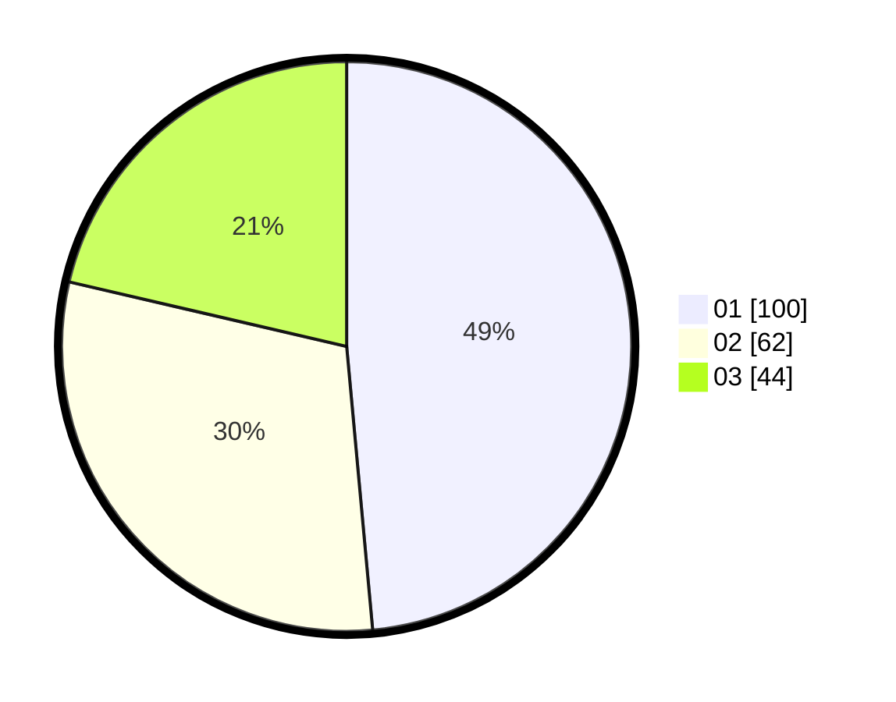

# Hasil

Hasil perolehan suara paslon dapat dilihat pada file paslon-01.txt, paslon-02.txt, dan paslon-03.txt.

Jika tidak ada, artinya data tersebut belum ada pada SIREKAP.

## Perolehan Suara

 * Paslon 01: **100**.
 * Paslon 02: **62**.
 * Paslon 03: **44**.

## Foto C Plano

https://sirekap-obj-formc.kpu.go.id/8bcb/pemilu/ppwp/31/75/07/10/03/3175071003035-20240214-233040--04fc2358-6073-46ec-8011-cd6927b6dfd4.jpg

https://sirekap-obj-formc.kpu.go.id/8bcb/pemilu/ppwp/31/75/07/10/03/3175071003035-20240214-232147--a249389b-2dd5-41ba-9ad5-a047cf2bd9ca.jpg

https://sirekap-obj-formc.kpu.go.id/8bcb/pemilu/ppwp/31/75/07/10/03/3175071003035-20240214-232310--9c3683f1-2a83-46db-8710-3002d1468f9d.jpg
